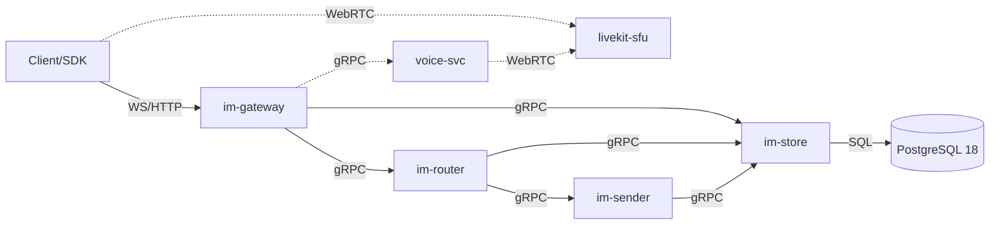
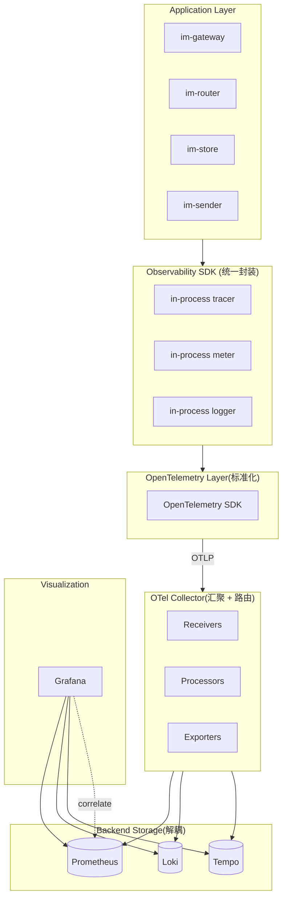
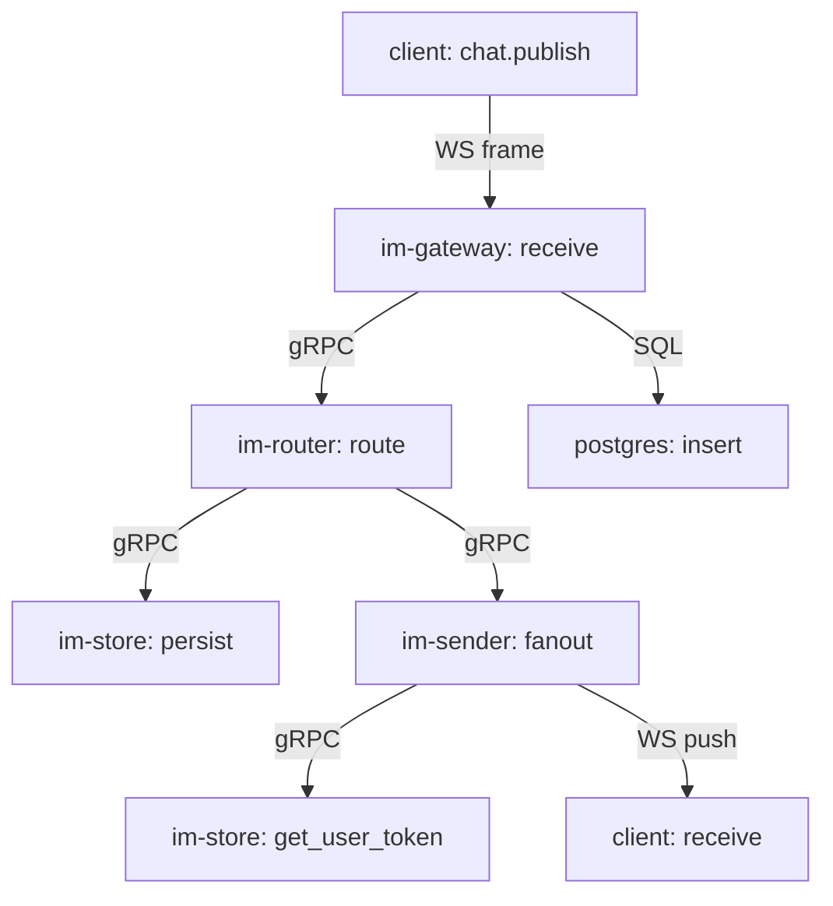

# IM1.0 可观测性架构设计文档 (Observability Architecture)

> **目标**:在不破坏业务的前提下,为 IM1.0 平台建立完整的可观测性闭环。
>
> 闭环流程:**Observe → Detect → Correlate → Diagnose → Alert → Recover**
>
> **本文件版本**:v1.0.0 | **状态**:Draft | **作者**:SRE / Cloud Native Architect

---

## 0. 文档信息

| 字段 | 值 |
|---|---|
| 文档 ID | OBS-DOC-001 |
| 版本 | v1.0.0 |
| 状态 | Draft |
| 创建日期 | 2026-08-20 |
| 维护方 | SRE / Tech Lead |
| 关联文档 | `SRS.md` `BasicDesign.md` `DetailedDesign.md` `Deployment-Runbook.md` `Project-Status.md` `Platform-Specifics.md` `Workflow.md` |
| 受众 | 架构师、SRE、Tech Lead、研发全员 |

### 0.1 需求 ID 体系

| 前缀 | 含义 | 示例 |
|---|---|---|
| `OBS-REQ-NNN` | 业务需求 | OBS-REQ-001 |
| `OBS-ARCH-NNN` | 架构决定 | OBS-ARCH-001 |
| `OBS-COMP-NNN` | 组件配置 | OBS-COMP-001 |
| `OBS-MET-NNN` | 指标定义 | OBS-MET-001 |
| `OBS-LOG-NNN` | 日志规范 | OBS-LOG-001 |
| `OBS-TRC-NNN` | 追踪规范 | OBS-TRC-001 |
| `OBS-ALT-NNN` | 告警规则 | OBS-ALT-001 |
| `OBS-SLO-NNN` | SLO 定义 | OBS-SLO-001 |
| `OBS-SEC-NNN` | 安全要求 | OBS-SEC-001 |
| `OBS-DSH-NNN` | Dashboard | OBS-DSH-001 |

---

## 1. 现状调查 (Phase 0 - As-Is Analysis)

> **原则**:禁止直接安装监控组件,先全面分析现有系统。

### 1.1 架构调查

#### 1.1.1 服务清单(基于 `DetailedDesign.md` §1 + `BasicDesign.md`)

| 服务 | 类型 | 职责 | 通信 | 端口(预期) |
|---|---|---|---|---|
| `im-gateway` | Rust + actix-web 4 | HTTP + WebSocket 网关 | HTTP/WS(入) + gRPC(出) | 8080 |
| `im-router` | Rust + actix-web 4 | 消息路由 | gRPC | 9001 |
| `im-store` | Rust + actix-web 4 | DB 访问层 | gRPC | 9002 |
| `im-sender` | Rust | 消息推送(扇出) | gRPC | 9003 |
| `im-protocol` | Crate | WS 消息 / 错误码定义 | (库,非服务) | — |
| `im-common` | Crate | 共享类型 / 工具 | (库) | — |
| `voice-svc` | Rust | 语音服务(后期) | gRPC + WebRTC | 9100 |
| `livekit-sfu` | LiveKit OSS | 语音 SFU | WebRTC | 7881 (TCP) / 7882/UDP |
| `postgres` | PG 18 | 主数据库 | SQL | 5432 |

> **当前规模**:6 个 Rust 服务 + 1 个 SFU + 1 个 DB(预期)
> **状态**:Day 1 阶段,大部分服务尚未实现;但设计完整

#### 1.1.2 服务通信拓扑(预期)



#### 1.1.3 API 边界

- **入向**:WebSocket `/ws`(长连接)+ REST `/api/v1/*`
- **服务间**:gRPC(`im-router` / `im-store` / `im-sender` 内部)
- **出向**:LiveKit WebRTC(voice-svc)

#### 1.1.4 中间件 / 数据

| 组件 | 当前 | 未来 | 备注 |
|---|---|---|---|
| 消息队列 | ❌ 无 | Kafka / NATS(待定) | MVP 不引入 |
| 缓存 | ❌ 无 | Redis(后期) | MVP 不引入 |
| 全文搜索 | ❌ 无 | OpenSearch(后期) | 业务尚不需 |
| 对象存储 | ❌ 无 | S3 兼容(后期) | 媒体文件用 |
| 配置中心 | ❌ 无 | Consul / Nacos(待定) | 暂用 env |

### 1.2 部署调查

| 维度 | 当前设计 | 备注 |
|---|---|---|
| 容器化 | Docker | `docker/im-*.Dockerfile`(详见 `Platform-Specifics.md` §6) |
| 镜像仓库 | GHCR | `ghcr.io/{org}/im1.0-*` |
| 编排 | K3s | dev: `k3d` 单节点;prod: 多节点 |
| 命名空间 | `im1-dev` / `im1-staging` / `im1-prod` | 后续 `im1-obs` 监控用 |
| Workload 类型 | Deployment(无状态) + StatefulSet(PG) | |
| Service | ClusterIP(内部)+ NodePort / Ingress(外部) | |
| Ingress | nginx-ingress(K3s 默认) | WebSocket 长连接需 `proxy-read-timeout` |
| ConfigMap | env 注入 + 配置文件 | |
| Secret | JWT_SECRET / DB 密码 | 暂用手写,后期 Vault |
| Storage | PVC(本地 PV,dev) → 后续云盘 | |
| Network Policy | ❌ 未启用 | 后期加,详见 §17 |
| 滚动发布 | `kubectl rollout` / GH Actions `deploy-dev` | |
| HPA | ❌ 未启用 | MVP 不引入 |

### 1.3 运行环境调查

| 维度 | 当前 | 备注 |
|---|---|---|
| Node OS | Ubuntu 22.04(K3s 节点) | |
| 容器运行时 | containerd(K3s 默认) | |
| CPU | 单节点 4 vCPU(dev) → 16+ vCPU(prod) | |
| Memory | 8 GB(dev) → 64+ GB(prod) | |
| Disk | 50 GB SSD(dev) | |
| Network | 1 Gbps 内网,公网经 LB | |
| 时区 | UTC(K3s / 应用统一) | |
| K8s 版本 | K3s v1.30+(跟 stable channel) | |
| 内核参数 | 默认 | 需 `vm.max_map_count` 调优(ES 后期) |

### 1.4 代码结构调查(基于 `DetailedDesign.md`)

#### 1.4.1 Rust Workspace 结构

```
im1.0/
├── crates/
│   ├── im-common/       # 共享类型 / 错误码
│   ├── im-protocol/     # WS 消息 / proto
│   ├── im-store/        # DB 访问
│   ├── im-gateway/      # HTTP + WebSocket(actix-web 4)
│   ├── im-router/       # 消息路由
│   └── im-sender/       # 消息推送
```

#### 1.4.2 中间件 / 关键库(预期依赖)

| 用途 | Crate | 备注 |
|---|---|---|
| 异步运行时 | `tokio = "1"` | actix-web 内置 |
| Web 框架 | `actix-web = "4"` | |
| WebSocket | `actix-ws = "0.3"` | |
| DB | `sqlx = "0.8"` | PostgreSQL 驱动 |
| 序列化 | `serde = "1"`, `serde_json = "1"` | |
| JWT | `jsonwebtoken = "9"` | |
| 密码哈希 | `argon2 = "0.5"` | |
| 日志 | `tracing = "0.1"`, `tracing-subscriber = "0.3"`, `tracing-actix-web = "0.7"` | **关键:已是可观测性友好的栈** |
| 错误处理 | `thiserror = "1"`, `anyhow = "1"` | |
| 错误码 | (aux-03 定义) | |
| 配置 | `figment = "0.10"` 或 `config = "0.14"` | |

> **关键观察**:项目已选 `tracing` 生态,这与 OpenTelemetry 兼容(`tracing-opentelemetry` 适配器存在)。
> 这是接入可观测性的良好基础。

#### 1.4.3 现有可观测性"现状"(几乎是零)

| 维度 | 现状 | 缺口 |
|---|---|---|
| 日志 | `tracing` 输出到 stdout(JSON 格式待定) | 无集中收集;无 trace_id 关联 |
| Metrics | ❌ 无 | 0 个指标 |
| Trace | ❌ 无 | 无 span |
| 健康检查 | `/healthz` / `/readyz`(在 `Platform-Specifics.md` §7) | 单点,无 /metrics 端点 |
| 错误响应 | aux-03 错误码体系 | 无标准化的 error 字段注入 |

#### 1.4.4 日志格式现状(假设)

当前预期是 `tracing` 默认格式 + 日志到 stdout。`tracing-subscriber` 配置 JSON 输出即可,影响极小。

### 1.5 现状分析结论

| 维度 | 评分 | 关键问题 |
|---|---|---|
| 日志基础 | 6/10 | `tracing` 已在,但无 OTel 适配,无 trace_id 关联,无集中化 |
| Metrics | 1/10 | 完全缺失 |
| Trace | 1/10 | 完全缺失 |
| 部署基础 | 7/10 | K3s + Docker + GHCR 完备,但 HPA / NetworkPolicy 缺 |
| 代码友好度 | 8/10 | `tracing` + sqlx + tokio 都是 OTel 友好栈,接入成本低 |
| 文档完整度 | 9/10 | 有 SRS / BasicDesign / DetailedDesign / Runbook |

**结论**:**接入可观测性的代码 / 部署成本低**(主要是加 SDK),主要工作量在**配置和后端基础设施**。可以分阶段、低风险推进。

---

## 2. 需求定义 (Business & Functional Requirements)

### OBS-REQ-001 统一接入

业务代码**只**关心:
- 创建指标
- 记录事件
- 创建 Trace
- **不关心**数据发送到哪里 / 用什么后端

### OBS-REQ-002 三大支柱

| 支柱 | 含义 | 必达 |
|---|---|---|
| Metrics | 数值化测量 | ✅ |
| Logs | 结构化事件 | ✅ |
| Traces | 请求链路 | ✅ |
| Events | 业务事件(用户登录 / 封禁 / 房间创建) | 后期 |

### OBS-REQ-003 关联能力

通过 `trace_id` 单一键,实现:
- Metric → Trace(从指标看相关 Trace)
- Trace → Logs(从链路看相关日志)
- Log → Trace(从日志跳回 Trace)

### OBS-REQ-004 故障定位

5 分钟内定位:
- 哪个服务异常
- 何时开始
- 影响范围
- 根因(代码 / DB / 依赖)

### OBS-REQ-005 容量规划

提供:
- 资源使用趋势(CPU / 内存 / 磁盘 / 网络)
- 业务量增长预测
- 容量告警(达到 80% 阈值)

### OBS-REQ-006 SLO 可见

| SLO | 目标(MVP 阶段) | 度量 |
|---|---|---|
| API 可用性 | 99.5% | 成功请求 / 总请求 |
| 端到端 P99 延迟 | < 500ms | im-gateway 入到出 |
| 错误率 | < 1% | 5xx 比例 |

### OBS-REQ-007 安全

- 监控系统不在公网裸露
- RBAC 控制
- 不记录敏感数据

### OBS-REQ-008 低侵入

- 业务代码改动 ≤ 10 行 / 服务
- 不引入同步阻塞
- 不影响核心路径延迟 > 5%

---

## 3. 非功能需求 (NFR)

| 类别 | 需求 | 度量 |
|---|---|---|
| **性能开销** | CPU < 3%,内存 < 50MB / 服务,网络 < 5% | 压测 |
| **可靠性** | Collector / Backend 不影响业务 SLO | 故障注入 |
| **可扩展** | 数据量 10x 增长,平台仍能跑 | 容量规划 |
| **数据保留** | Metrics 30d / Logs 30d / Traces 7d | 存储策略 |
| **告警响应** | Critical < 5min 通知,High < 30min | 历史数据 |
| **可移植** | 后端可换(Mimir / Loki / Tempo 替代) | 用 OTel 标准 |
| **多环境** | dev / staging / prod 隔离 | Namespace + RBAC |

---

## 4. 总体架构

### 4.1 分层架构



### 4.2 数据流

```
[业务代码]
   │
   │ ① 创建 Span / Counter / Histogram / Event
   ▼
[in-process SDK(tracing + opentelemetry)]
   │
   │ ② 异步批量发送(批大小 512 / 超时 5s)
   ▼
[OTel Collector(Deployment,im1-obs ns)]
   │
   │ ③ 接收(otlp/grpc + 主机 / k8s 属性)
   │ ④ 处理(批 / 采样 / 脱敏 / 资源属性注入)
   │ ⑤ 路由(按信号类型分发)
   ▼
[Backend:Prometheus / Loki / Tempo]
   │
   ▼
[Grafana(查询 + Dashboard + Alert)]
   │
   ▼
[Alertmanager → Slack / 飞书 / 邮件]
```

### 4.3 关键架构原则

1. **业务不直连后端**:业务代码只调 OTel SDK,后端可换(详见 §5)。
2. **标准化**:OTel 是工业标准,不被任何单一厂商绑定。
3. **解耦**:Collector 抽象数据流向,可在不重启业务的情况下调整路由。
4. **批处理 + 异步**:SDK 异步批量,不影响业务延迟。
5. **资源属性一致**:所有遥测数据带 `service.name` / `service.version` / `k8s.pod.name` 等统一属性。

---

## 5. 技术方案评估

### 5.1 Visualization

#### OBS-ARCH-001 选用 Grafana

| 选项 | 评估 | 结论 |
|---|---|---|
| **Grafana** | 业界事实标准,支持多数据源关联,Alertmanager 集成强 | **选用** |
| Kibana | 强在 ES,弱在多源 | 不选 |
| Datadog | SaaS,费用高 | 不选(本项目开源优先) |

### 5.2 Metrics

#### OBS-ARCH-002 Prometheus(短期)→ Mimir(长期)

| 选项 | 评估 | 结论 |
|---|---|---|
| **Prometheus** | 单机存储,30 天保留;生态完善;Operator 成熟 | **MVP 选用** |
| Mimir | 水平扩展,长期保留;适合 10x 增长 | **长期迁移** |
| VictoriaMetrics | 单二进制,低资源;但生态弱于 Prometheus | 备选 |
| InfluxDB | 时序为主,但与 PromQL 不兼容 | 不选 |

**决策**:MVP 用 **Prometheus + Thanos Object Storage(可选)**,日增长超 50GB / 单 Prometheus 时考虑 Mimir。

### 5.3 Logs

#### OBS-ARCH-003 选用 Loki

| 选项 | 评估 | 结论 |
|---|---|---|
| **Loki** | "Prometheus for logs",与 Grafana 原生集成,LogQL 易学 | **选用** |
| Elasticsearch | 全文搜索强,但资源消耗大(2-3x Loki) | 不选(本项目日志以结构化为主) |
| ClickHouse | 列存,功能强,但运维成本高 | 不选 |

### 5.4 Traces

#### OBS-ARCH-004 选用 Tempo

| 选项 | 评估 | 结论 |
|---|---|---|
| **Tempo** | 与 Grafana / Loki 原生集成,无索引(对象存储),低成本 | **选用** |
| Jaeger | 成熟但独立栈,集成成本高 | 不选 |
| Zipkin | 老旧 | 不选 |

### 5.5 Standard Layer

#### OBS-ARCH-005 强制使用 OpenTelemetry

- 业务 SDK:`opentelemetry` + `opentelemetry-otlp` + `tracing-opentelemetry`
- 避免:直接用 `prometheus` / `loki` / `tempo` 客户端
- 原因:标准化、可移植、生态齐全

### 5.6 Collector

#### OBS-ARCH-006 选用 OpenTelemetry Collector(Contrib)

- **部署模式**:Deployment + Service(otlp/grpc:4317, otlp/http:4318)
- **拓扑**:单一 Collector → Prometheus / Loki / Tempo
  - 简化部署,2-3 人极简团队不需要 Collector 集群
  - 后期日数据 > 100GB 时,改为 Gateway + Agent 模式

### 5.7 结论

```
Grafana  ─ 查询 + Dashboard + Alert
   │
   ├── Prometheus (Metrics, 30d)
   ├── Loki (Logs, 30d, 压缩)
   └── Tempo (Traces, 7d, 对象存储)
                ▲
                │ OTLP
                │
       OTel Collector (im1-obs ns)
                ▲
                │ OTLP
                │
       业务服务(各 ns)统一用 OTel SDK
```

---

## 6. 接入设计 (Observability SDK / Layer)

### 6.1 业务代码统一接入方式

#### OBS-ARCH-007 在 `im-common` 中提供 `obs` 子模块

```rust
// crates/im-common/src/obs.rs
use opentelemetry::trace::TracerProvider as _;
use opentelemetry::KeyValue;
use opentelemetry_otlp::WithExportConfig;
use opentelemetry_sdk::{
    Resource,
    runtime::Tokio,
    trace::Config as TraceConfig,
    metrics::Config as MetricsConfig,
};
use tracing_subscriber::{layer::SubscriberExt, util::SubscriberInitExt, EnvFilter};

/// 初始化 Tracing + Metrics + Logs(三支柱)
/// 业务服务启动时调用一次。
pub fn init(service_name: &'static str, service_version: &'static str) -> Result<()> {
    let resource = Resource::new(vec![
        KeyValue::new("service.name", service_name),
        KeyValue::new("service.version", service_version),
        KeyValue::new("deployment.environment", env::var("ENV").unwrap_or("dev".into())),
        KeyValue::new("k8s.pod.name", env::var("POD_NAME").unwrap_or_default()),
        KeyValue::new("k8s.namespace.name", env::var("POD_NAMESPACE").unwrap_or_default()),
    ]);

    // Tracer: OTLP/gRPC → Collector
    let tracer = opentelemetry_otlp::new_pipeline()
        .tracing()
        .with_exporter(opentelemetry_otlp::new_exporter()
            .tonic()
            .with_endpoint("http://otel-collector.im1-obs.svc.cluster.local:4317"))
        .with_trace_config(TraceConfig::default().with_resource(resource.clone()))
        .install_batch(Tokio)?;

    // Meter: OTLP/gRPC → Collector
    let meter = opentelemetry_otlp::new_pipeline()
        .metrics(Tokio)
        .with_exporter(opentelemetry_otlp::new_exporter()
            .tonic()
            .with_endpoint("http://otel-collector.im1-obs.svc.cluster.local:4317"))
        .with_metrics_config(MetricsConfig::default().with_resource(resource.clone()))
        .build()?;

    // 日志:tracing-subscriber + tracing-opentelemetry
    let otel_layer = tracing_opentelemetry::layer().with_tracer(tracer);
    let fmt_layer = tracing_subscriber::fmt::layer()
        .json()
        .with_current_span(true)
        .with_span_list(false);

    tracing_subscriber::registry()
        .with(EnvFilter::try_from_default_env()
            .unwrap_or_else(|_| EnvFilter::new("info,sqlx=warn")))
        .with(fmt_layer)
        .with(otel_layer)
        .init();

    Ok(())
}
```

#### 业务服务 main() 调用

```rust
// crates/im-gateway/src/main.rs
use im_common::obs;

#[actix_web::main]
async fn main() -> Result<(), Box<dyn std::error::Error>> {
    obs::init("im-gateway", env!("CARGO_PKG_VERSION"))?;
    // ... 业务代码
}
```

### 6.2 业务代码使用的 4 类 API

#### 6.2.1 创建指标(无侵入)

```rust
// im-gateway 的请求计数
use im_common::obs;

static REQUEST_TOTAL: Lazy<IntCounterVec> = Lazy::new(|| {
    obs::meter()
        .int_counter_vec("http.server.request.total")
        .with_description("Total HTTP requests")
        .with_unit("1")
        .init()
});

static REQUEST_DURATION: Lazy<Histogram<f64>> = Lazy::new(|| {
    obs::meter()
        .f64_histogram("http.server.request.duration")
        .with_description("HTTP request duration in seconds")
        .with_unit("s")
        .with_boundaries(vec![0.005, 0.01, 0.025, 0.05, 0.1, 0.25, 0.5, 1.0, 2.5, 5.0])
        .init()
});
```

#### 6.2.2 中间件自动埋点(actix-web)

```rust
// crates/im-gateway/src/middleware/metrics.rs
use actix_web::dev::{Service, ServiceRequest, ServiceResponse, Transform};
use std::future::{ready, Ready};

pub struct MetricsMiddleware;

impl<S, B> Transform<S, ServiceRequest> for MetricsMiddleware
where S: Service<ServiceRequest, Response = ServiceResponse<B>, Error = actix_web::Error>,
      S::Future: 'static, B: 'static
{
    type Response = ServiceResponse<B>;
    type Error = actix_web::Error;
    type Transform = MetricsMiddlewareInner<S>;
    type InitError = ();
    type Future = Ready<Result<Self::Transform, Self::InitError>>;
    fn new_transform(&self, service: S) -> Self::Future {
        ready(Ok(MetricsMiddlewareInner { service }))
    }
}

pub struct MetricsMiddlewareInner<S> { service: S }

impl<S, B> Service<ServiceRequest> for MetricsMiddlewareInner<S>
where S: Service<ServiceRequest, Response = ServiceResponse<B>, Error = actix_web::Error>,
      S::Future: 'static, B: 'static
{
    type Response = ServiceResponse<B>;
    type Error = actix_web::Error;
    type Future = std::pin::Pin<Box<dyn std::future::Future<Output = Result<ServiceResponse<B>, actix_web::Error>>>>;

    fn call(&self, req: ServiceRequest) -> Self::Future {
        let started = std::time::Instant::now();
        let method = req.method().clone();
        let path = req.path().to_string();
        let fut = self.service.call(req);
        Box::pin(async move {
            let res = fut.await?;
            let status = res.status().as_u16();
            let elapsed = started.elapsed().as_secs_f64();
            REQUEST_TOTAL.with(&[("method", method.as_str()), ("path", &path), ("status", status.to_string().as_str())]).add(1);
            REQUEST_DURATION.record(elapsed);
            Ok(res)
        })
    }
}
```

> **关键**:中间件自动埋点,**业务 handler 零改动**。RED 指标全部覆盖。

#### 6.2.3 创建 Span(Tracing)

```rust
use tracing::{instrument, info, error, span, Level};

#[instrument(skip(payload), fields(msg_id, peer_id))]
pub async fn publish_message(payload: MessagePayload) -> Result<MessageId> {
    let span = tracing::Span::current();
    span.record("msg_id", &tracing::field::display(payload.id));
    span.record("peer_id", &payload.peer_id);
    info!("publishing message");
    // ... 业务逻辑
}
```

#### 6.2.4 记录事件(Logs)

```rust
use tracing::{info, warn, error};

info!(user_id = %uid, room_id = %rid, "user joined room");
error!(error_code = "AUTH_TOKEN_EXPIRED", "token validation failed");
```

### 6.3 禁止业务直接做的事

| ❌ 禁止 | 原因 |
|---|---|
| 直接 `reqwest` 调 Grafana / Prometheus / Loki API | 绕过抽象,绑死后端 |
| 在业务代码中组装 PromQL / LogQL | 同上 |
| 写自定义 HTTP 端点暴露 `/metrics` | 由 OTel SDK / Prometheus exporter 自动提供 |
| 在主路径同步等待遥测发送 | 阻塞业务 |

---

## 7. Metrics 设计

### 7.1 指标体系总览

| 类别 | 命名空间 | 必含 |
|---|---|---|
| Infrastructure | `infra_*` | CPU / 内存 / 磁盘 / 网络 |
| Container | `container_*` | cgroup 限制 / 用量 |
| K8s | `k8s_*` | Pod 状态 / 重启 / 调度 |
| Application | `http_server_*` / `grpc_server_*` / `ws_*` | RED + USE |
| Database | `db_*` | 连接 / 查询延迟 / 慢查询 / 锁 |
| Middleware | `livekit_*` / `external_*` | 第三方依赖 |

### 7.2 Infrastructure Metrics

#### OBS-MET-001 Node 级(由 node-exporter 暴露)

| 指标 | 类型 | 单位 | 说明 |
|---|---|---|---|
| `node_cpu_seconds_total` | Counter | s | CPU 时间累计 |
| `node_memory_MemAvailable_bytes` | Gauge | bytes | 可用内存 |
| `node_memory_MemTotal_bytes` | Gauge | bytes | 总内存 |
| `node_filesystem_avail_bytes` | Gauge | bytes | 文件系统可用 |
| `node_network_receive_bytes_total` | Counter | bytes | 网络接收 |
| `node_network_transmit_bytes_total` | Counter | bytes | 网络发送 |
| `node_load1` / `node_load5` / `node_load15` | Gauge | 1 | 负载均值 |

#### OBS-MET-002 Container 级(cAdvisor,K3s 内置)

| 指标 | 类型 | 说明 |
|---|---|---|
| `container_cpu_usage_seconds_total` | Counter | 容器 CPU |
| `container_memory_usage_bytes` | Gauge | 容器内存 |
| `container_network_*` | Counter | 容器网络 |
| `kube_pod_container_resource_limits` | Gauge | cgroup 限制 |
| `kube_pod_container_status_running` | Gauge | 状态 |

### 7.3 K8s Metrics(由 kube-state-metrics 暴露)

#### OBS-MET-003 K8s 对象

| 指标 | 类型 | 说明 |
|---|---|---|
| `kube_pod_status_phase` | Gauge | Pod 阶段 |
| `kube_pod_container_status_restarts_total` | Counter | 重启次数 |
| `kube_pod_container_status_waiting_reason` | Gauge | 等待原因(CrashLoopBackOff 等) |
| `kube_deployment_status_replicas_available` | Gauge | 可用副本 |
| `kube_deployment_spec_replicas` | Gauge | 期望副本 |
| `kube_node_status_condition` | Gauge | 节点状态 |
| `kube_pod_container_resource_requests` | Gauge | 资源请求 |

### 7.4 Application Metrics(RED + USE)

#### OBS-MET-004 HTTP RED(im-gateway)

| 指标 | 类型 | 单位 | 标签 | 必含 |
|---|---|---|---|---|
| `http_server_request_total` | Counter | 1 | method, path, status | ✅ |
| `http_server_request_errors_total` | Counter | 1 | method, path, error_code | ✅ |
| `http_server_request_duration_seconds` | Histogram | s | method, path, status | ✅ |
| `http_server_request_size_bytes` | Histogram | bytes | method, path | ✅ |
| `http_server_response_size_bytes` | Histogram | bytes | method, path | ✅ |
| `http_server_requests_in_flight` | UpDownCounter | 1 | method, path | ✅ |

#### OBS-MET-005 WebSocket(im-gateway)

| 指标 | 类型 | 单位 | 标签 | 必含 |
|---|---|---|---|---|
| `ws_connection_active` | UpDownCounter | 1 | room_type | ✅ |
| `ws_connection_total` | Counter | 1 | — | ✅ |
| `ws_connection_duration_seconds` | Histogram | s | close_reason | ✅ |
| `ws_messages_received_total` | Counter | 1 | op | ✅ |
| `ws_messages_sent_total` | Counter | 1 | op | ✅ |
| `ws_message_publish_latency_seconds` | Histogram | s | — | ✅ |

#### OBS-MET-006 gRPC(内部服务)

| 指标 | 类型 | 单位 | 标签 |
|---|---|---|---|
| `grpc_server_handled_total` | Counter | 1 | service, method, code |
| `grpc_server_handled_duration_seconds` | Histogram | s | service, method |
| `grpc_server_requests_in_flight` | UpDownCounter | 1 | service, method |

#### OBS-MET-007 USE(每个服务通用)

| 指标 | 类型 | 说明 |
|---|---|---|
| `process_cpu_seconds_total` | Counter | 进程 CPU |
| `process_resident_memory_bytes` | Gauge | 常驻内存 |
| `process_open_fds` | Gauge | 打开 fd |
| `process_max_fds` | Gauge | 最大 fd |
| `tokio_task_total` | UpDownCounter | 活跃任务 |
| `tokio_worker_threads` | Gauge | worker 数 |

### 7.5 关键指标(必实现)

| 指标 | 必达 | 度量 |
|---|---|---|
| `http_server_request_total{method,path,status}` | ✅ | 业务可见性 |
| `http_server_request_duration_seconds_bucket{le}` | ✅ | 延迟分布 |
| `ws_connection_active` | ✅ | 在线用户 |
| `db_pool_connections_*`(详见 §10) | ✅ | DB 容量 |
| `db_query_duration_seconds_bucket{le,query_type}` | ✅ | DB 慢查询 |

### 7.6 Cardinality 控制

> **关键风险**:标签值数量无限增长会导致 Prometheus OOM。

| 标签 | 限制 | 措施 |
|---|---|---|
| `path` | ≤ 1000 个唯一值 | URL normalization(`/v1/users/{id}` 不展开) |
| `user_id` | ❌ 禁止 | 走 Span(Trace)而非 Metric |
| `room_id` | ❌ 禁止 | 走 Span |
| `msg_id` | ❌ 禁止 | 走 Span |
| `error_code` | ≤ 200 个(aux-03) | 受限 |
| `status` | ≤ 10 个 | 标准 HTTP code |
| `method` | ≤ 20 个 | 限 HTTP/gRPC 方法 |

**强制**:业务代码提交 Metric 时,标签必须从受控白名单取,否则 CI 阻断。

---

## 8. Logging 设计

### 8.1 结构化日志格式

#### OBS-LOG-001 JSON 输出

每行一条 JSON,字段:

```json
{
  "timestamp": "2026-08-20T22:00:00.123Z",
  "level": "INFO",
  "service": "im-gateway",
  "version": "0.1.0",
  "environment": "dev",
  "instance": "im-gateway-7d8b9c-x7f2d",
  "trace_id": "abc123def456",
  "span_id": "789ghi",
  "request_id": "req-uuid",
  "module": "im_gateway::middleware",
  "event": "http_request",
  "error_code": "AUTH_TOKEN_EXPIRED",
  "message": "Token validation failed",
  "user_id": "u_123",
  "latency_ms": 45
}
```

### 8.2 字段规范

| 字段 | 必填 | 来源 | 格式 |
|---|---|---|---|
| `timestamp` | ✅ | tracing 自动 | RFC 3339 |
| `level` | ✅ | tracing | INFO / WARN / ERROR / DEBUG |
| `service` | ✅ | im-common::obs 注入 | string |
| `version` | ✅ | CARGO_PKG_VERSION | semver |
| `environment` | ✅ | ENV env var | dev / staging / prod |
| `instance` | ✅ | POD_NAME env | k8s pod name |
| `trace_id` | 业务 span 内 ✅ | OTel 注入 | hex(16 bytes) |
| `span_id` | 业务 span 内 ✅ | OTel 注入 | hex(8 bytes) |
| `request_id` | 请求维度 ✅ | 中间件生成 | UUID v4 |
| `module` | ✅ | tracing target | rust module path |
| `event` | ✅ | 业务字段 | snake_case 命名 |
| `error_code` | 出错时 | aux-03 | string |
| `message` | ✅ | tracing | human-readable |

### 8.3 日志等级策略

| 等级 | 使用场景 | 比例(MVP 阶段) |
|---|---|---|
| ERROR | 影响业务的错误(5xx / 数据丢失) | < 1% |
| WARN | 需关注但不阻塞(重试 / 慢查询) | < 5% |
| INFO | 关键业务事件(登录 / 发消息) | 50-70% |
| DEBUG | 调试信息(默认关闭) | 0% |
| TRACE | 详细 trace(默认关闭) | 0% |

> 通过 `EnvFilter` 控制,默认值 `info,sqlx=warn`。

### 8.4 禁止记录的字段

#### OBS-LOG-002 敏感数据屏蔽

| 字段 | 处置 |
|---|---|
| `password` | 全 `*` 屏蔽 |
| `password_hash` | 全 `*` |
| `token` / `access_token` / `refresh_token` | 全 `*` |
| `secret` / `api_key` | 全 `*` |
| `cookie` | 全 `*` |
| `credit_card` | 末 4 位 |
| 身份证号 | 仅保留地区码 |
| 手机号 | 中间 4 位 `*` |

**实现**:在 OTel Collector 阶段通过 `transform` processor + 正则替换。

### 8.5 采样策略

| 场景 | 采样率 |
|---|---|
| ERROR(全部业务错误) | 100% |
| WARN(慢查询 / 重试) | 100% |
| INFO(关键业务) | 100% |
| INFO(高频 DEBUG) | 10% |
| DEBUG / TRACE | 0%(默认关闭) |
| 请求访问日志 | 100% |

> 后期 INFO 高频可达 1k+/s 时,降采样到 10%。

### 8.6 保留策略

| 等级 | 保留 |
|---|---|
| ERROR | 90 天 |
| WARN | 30 天 |
| INFO | 30 天 |
| DEBUG / TRACE | 不记录 |

---

## 9. Distributed Tracing 设计

### 9.1 Trace Context 传播

#### OBS-TRC-001 W3C Trace Context(W3C `traceparent` header)

```
traceparent: 00-{trace_id_32hex}-{span_id_16hex}-{flags_2hex}
```

- HTTP:`traceparent` 头
- gRPC:`grpc-trace-bin` 头(Metadata)
- WebSocket:首个 frame 的 `auth` 消息携带 `trace_id`(无 header,需手动注入)

### 9.2 Span 层次(预期)



### 9.3 Span 命名规范

| 服务 | Span 名 | 操作 |
|---|---|---|
| im-gateway | `http {method} {path}` | HTTP handler |
| im-gateway | `ws {op}` | WS 消息 |
| im-router | `gRPC {Service}.{Method}` | gRPC handler |
| im-store | `db {operation} {table}` | DB 操作 |
| sqlx | `postgres.query` | SQL 执行 |
| voice-svc | `livekit.{op}` | LiveKit 操作 |
| external | `http {method} {host}{path}` | 出向 HTTP |

### 9.4 Span 属性(标准)

| 属性 | OTel 名 | 类型 | 必含 |
|---|---|---|---|
| 服务 | `service.name` | string | ✅ |
| 版本 | `service.version` | string | ✅ |
| 环境 | `deployment.environment` | string | ✅ |
| 实例 | `service.instance.id` | string | ✅ |
| K8s pod | `k8s.pod.name` | string | ✅ |
| K8s ns | `k8s.namespace.name` | string | ✅ |
| HTTP method | `http.request.method` | string | ✅ |
| HTTP path | `http.route` | string | ✅ |
| HTTP status | `http.response.status_code` | int | ✅ |
| gRPC service | `rpc.service` | string | ✅ |
| gRPC method | `rpc.method` | string | ✅ |
| gRPC code | `rpc.grpc.status_code` | int | ✅ |
| DB system | `db.system` | string | ✅ |
| DB statement | `db.statement` | string | (裁剪后) |

### 9.5 采样策略

#### OBS-TRC-002 自适应采样

| 类别 | 采样率 |
|---|---|
| ERROR Span | 100% |
| 慢 Span(> 1s) | 100% |
| 入口 Span(im-gateway) | 10% |
| 内部 Span(被父级决定) | 跟随父级 |
| DEBUG Span | 1% |

**实现**:OTel Collector 的 `tail_sampling` processor。

### 9.6 关键 Span 链

| 业务场景 | 必含 Span |
|---|---|
| 用户发消息 | gw: WS receive → router: route → store: persist → sender: fanout → store: get_user_token → WS send |
| 用户登录 | gw: POST /auth/login → store: get_user_by_email |
| 加入语音房间 | gw: HTTP /voice/join → voice-svc: join_room → livekit: create_participant |
| 拉取历史 | gw: GET /messages → store: list_messages_between |

---

## 10. Metrics + Logs + Trace 关联

### 10.1 关联机制

**唯一键**:`trace_id`(Hex 32 字节)

```
Metric(http_server_request_duration_seconds)  
  └─> label trace_id(可选,仅异常时记录)
  
Log
  └─> field trace_id(总是记录)

Trace
  └─> 每个 span 携带 trace_id
```

### 10.2 故障定位流程(标准化)

```
1. 收到告警 / 客户投诉
   ↓
2. 打开 Grafana 90 SLA/SLO Dashboard
   → 哪个 SLO 破了?
   ↓
3. 切到 30 Application Dashboard
   → 哪个服务的 RED 异常?
   ↓
4. 切到 40 Database Dashboard(若 DB 相关)
   → 哪个 query_type 慢?
   ↓
5. 查 Tempo(用对应 trace_id 或服务名搜索)
   → 慢的 span 是哪个?
   ↓
6. 查 Loki(用 trace_id 搜日志)
   → ERROR 日志的 error_code 是哪个?
   ↓
7. 定位根因 + 处理
```

### 10.3 Grafana 关联 UX

- Dashboard 面板间用 `data_links` 跳转到 Trace
- Trace 详情中点击 log 跳到 Loki
- Loki 详情中点击 metric 跳到 Prometheus
- **数据流**:Metric → Trace → Log → Root Cause

### 10.4 落地配置

```yaml
# grafana datasources/datasource.yaml
apiVersion: 1
datasources:
  - name: Prometheus
    type: prometheus
    url: http://prometheus.im1-obs.svc.cluster.local:9090
  - name: Loki
    type: loki
    url: http://loki.im1-obs.svc.cluster.local:3100
  - name: Tempo
    type: tempo
    url: http://tempo.im1-obs.svc.cluster.local:3100
    jsonData:
      tracesToLogsV2:
        datasourceUid: loki
        tags: ['job', 'trace_id']
        filterByTraceID: true
      tracesToMetrics:
        datasourceUid: prometheus
        tags: [{ key: 'service.name', value: 'service' }]
        filterByTraceID: false
```

---

## 11. 数据库可观测性

### 11.1 PostgreSQL 18 监控

#### OBS-MET-DB-001 关键指标

| 类别 | 指标 | 来源 |
|---|---|---|
| 连接 | `pg_stat_activity_count{state}` | sqlx + 自定义 exporter |
| 连接池 | `db_pool_connections{state="idle/active/pending"}` | sqlx-metrics |
| 查询 | `db_query_duration_seconds{query_type}` | sqlx-metrics |
| 慢查询 | `db_slow_queries_total{query_type}` | pgrexporter |
| 事务 | `pg_stat_database_xact_commit/d rollback_total` | pgrexporter |
| 锁 | `pg_locks_count{mode}` | pgrexporter |
| 死锁 | `pg_stat_database_deadlocks_total` | pgrexporter |
| 缓存 | `pg_stat_database_blks_hit/cache_hit_ratio` | pgrexporter |
| 复制 | `pg_stat_replication_lag_seconds` | pgrexporter(后期) |
| 容量 | `pg_database_size_bytes` | pgrexporter |
| 索引 | `pg_index_usage_ratio` | pgrexporter |

#### OBS-MET-DB-002 sqlx 自带 metric(数据库驱动层)

sqlx 0.8 + sqlx-metrics:
- `db.query.duration_seconds{query_type, table}` — Histogram
- `db.acquire.duration_seconds` — 获取连接耗时
- `db.connections.idle` / `db.connections.acquired` / `db.connections.max`

### 11.2 慢查询检测

#### OBS-LOG-DB-001 慢查询日志

```rust
// 在 sqlx 中配置
sqlx::postgres::PgPoolOptions::new()
    .max_connections(20)
    .acquire_timeout(Duration::from_secs(5))
    .slow_statement_log_level(tracing::Level::WARN)
    .slow_statement_threshold(Duration::from_millis(200))
```

慢查询自动记录到日志(带 `error_code = DB_SLOW_QUERY` + 完整 SQL + 耗时)。

### 11.3 Trace 关联

- sqlx 配合 `tracing` 自动为每个 query 创建 span
- Span 名:`postgres.query`
- 属性:`db.statement`(裁剪后)、`db.duration_seconds`
- 慢查询的 span 会被 Alertmanager 监控(> P95 持续 5min)

### 11.4 关键告警

| 告警 | 触发 | 详见 |
|---|---|---|
| 连接池耗尽 | `acquire.duration_seconds > 1s` 持续 1min | §14 |
| 死锁 | `pg_stat_database_deadlocks_total` 增量 > 0 | §14 |
| 缓存命中率低 | `cache_hit_ratio < 95%` 持续 5min | §14 |
| 慢查询激增 | P95 latency > 200ms 持续 5min | §14 |

---

## 12. 中间件可观测性

### 12.1 LiveKit SFU(后期)

| 指标 | 标签 | 说明 |
|---|---|---|
| `livekit_participants_active` | room_id(可裁剪到类型) | 在线参与者 |
| `livekit_packets_total` | direction, kind | 收发包数 |
| `livekit_packet_loss_ratio` | — | 丢包率 |
| `livekit_join_duration_seconds` | — | 加入耗时 |
| `livekit_connection_established_total` | — | 连接成功 |
| `livekit_connection_failed_total{reason}` | — | 失败原因 |

> LiveKit 自带 Prometheus exporter,详见 `LiveKit-Voice-Subsystem.md`。

### 12.2 外部 API

每个外部 HTTP 调用记录:
- URL / 方法 / 状态码 / 耗时
- 错误响应体(脱敏后)
- Trace 关联

```rust
// 出向 HTTP 客户端
#[instrument(skip(req), fields(http.url, http.method, http.status_code))]
pub async fn call_external_api(req: Request) -> Result<Response> {
    // ...
}
```

---

## 13. Grafana Dashboard 设计

### 13.1 Dashboard 编号体系

#### OBS-DSH-001 Dashboard 编号规范

```
00 System Overview
10 Infrastructure
20 Kubernetes
30 Application
40 Database
50 Middleware
60 Network
70 Performance
80 Security
90 SLA / SLO
```

### 13.2 Dashboard 必备问题

每个 Dashboard 必答:
1. **当前是否正常?** —— 大盘 RAG 状态(绿/黄/红)
2. **哪里异常?** —— Top N 异常指标
3. **什么时间开始?** —— 时间序列异常起始点
4. **影响范围?** —— 用户数 / 流量比例
5. **下一步如何定位?** —— 链接到下层 Dashboard / Trace

### 13.3 关键 Dashboard 设计

#### OBS-DSH-002 00 System Overview

| Panel | 类型 | 来源 |
|---|---|---|
| Overall SLO Status(可用性 / 延迟 / 错误率) | Stat | Prometheus |
| Top Errors(按 error_code) | Table | Loki + Prometheus |
| Active Incidents | Stat | Alertmanager |
| 当前在线用户(WS 连接数) | Stat | Prometheus |
| 当前 TPS | Graph | Prometheus |
| P99 延迟(7d) | Graph | Prometheus |

#### OBS-DSH-003 10 Infrastructure

| Panel | 说明 |
|---|---|
| CPU 节点级 | 按节点 |
| Memory 节点级 | 按节点 |
| Disk 节点级 | 按挂载点 |
| Network 节点级 | 按网卡 |
| Load Average | 1/5/15 分钟 |

#### OBS-DSH-004 20 Kubernetes

| Panel | 说明 |
|---|---|
| Pod 状态分布 | Running/Pending/Failed |
| 重启次数(Top 10) | Table |
| 资源使用 vs Request / Limit | Bar gauge |
| Deployment 副本可用性 | Stat |
| CrashLoopBackOff 告警 | Table |
| 调度失败 | Table |

#### OBS-DSH-005 30 Application(按服务分组)

每个服务 1 个 row:
- Request Rate
- Error Rate(by error_code)
- P50 / P95 / P99 延迟
- In-flight Requests
- Active WS Connections(仅 gateway)
- Service-Specific 指标

#### OBS-DSH-006 40 Database

| Panel | 说明 |
|---|---|
| 连接池状态 | idle/active/pending |
| 查询延迟 P50 / P95 / P99 | by query_type |
| 慢查询(Top 10) | Table |
| 事务 commit / rollback | Counter |
| 死锁次数 | Counter |
| 缓存命中率 | Gauge |
| 表大小 Top 10 | Table |
| 数据库总大小 | Stat |

#### OBS-DSH-007 50 Middleware

| Panel | 说明 |
|---|---|
| LiveKit 参与者数 | by room_type |
| LiveKit 丢包率 | by region |
| 外部 API 错误率 | by service |
| 外部 API P99 延迟 | by service |

#### OBS-DSH-008 60 Network

| Panel | 说明 |
|---|---|
| Ingress 请求量 | by host |
| 5xx 错误 | by host |
| WebSocket 活跃连接 | by room_type |
| K3s NodePort / ClusterIP 流量 | — |

#### OBS-DSH-009 70 Performance

| Panel | 说明 |
|---|---|
| USE 矩阵(utilization / saturation / errors) | per service |
| 慢查询 / 慢 span Top 10 | Table |
| 资源使用趋势(7d / 30d) | Graph |
| 容量增长预测(3 月) | Graph + 预测线 |

#### OBS-DSH-010 80 Security

| Panel | 说明 |
|---|---|
| 认证失败次数 | by reason |
| Token 过期 Top 用户 | Table(脱敏) |
| 异常 IP Top | Table |
| 限流触发次数 | by service |
| 慢登录攻击检测 | — |

#### OBS-DSH-011 90 SLA / SLO

| Panel | 说明 |
|---|---|
| 当前 SLO 状态 | Stat(绿/黄/红) |
| Error Budget 剩余 | Gauge |
| Burn Rate(短期 + 长期) | Graph |
| 7d 可用性 | Graph |
| 7d 错误率 | Graph |
| 7d P99 延迟 | Graph |

### 13.4 Dashboard 命名与标签

```
命名: {number}-{area}-{subarea}-{purpose}
例: 30-app-gateway-overview
    40-db-postgres-pool
    90-slo-availability-burn
```

---

## 14. Alert 设计

### 14.1 等级体系

| 等级 | 含义 | 响应时间 | 通知渠道 |
|---|---|---|---|
| **Critical** | 服务不可用 / 数据丢失 / SLO 严重突破 | 5 min | 电话 + Slack + 飞书 |
| **High** | 性能严重下降 / 部分功能异常 | 30 min | Slack + 飞书 |
| **Warning** | 潜在问题 / 资源接近阈值 | 4 h | Slack |
| **Info** | 状态变化 / 部署完成 | 异步 | Slack(频道) |

### 14.2 Alert 必备字段

#### OBS-ALT-001 Alert 元数据规范

每个 Alert 必须包含:

| 字段 | 含义 | 示例 |
|---|---|---|
| `summary` | 简短描述 | `im-gateway 错误率超阈值` |
| `description` | 详细 + 数值 | `5min 错误率 2.3%,阈值 1%` |
| `severity` | 等级 | critical / high / warning / info |
| `service` | 受影响服务 | im-gateway |
| `runbook_url` | 排查步骤链接 | (内网 doc) |
| `dashboard_url` | 关联 Dashboard | (Grafana) |
| `silence_url` | 静默链接 | (Alertmanager) |
| `query` | PromQL / LogQL | (可一键复现) |
| `impact` | 业务影响 | 用户无法发消息 |
| `recovery` | 恢复步骤 | (回滚 / 扩容) |

### 14.3 关键 Alert 规则

#### OBS-ALT-002 Critical 级(5min 内响应)

| 名称 | 触发 | 持续 | 查询 |
|---|---|---|---|
| API 错误率 > 5% | 5xx / 总数 > 5% | 1 min | `sum(rate(http_server_request_errors_total[5m])) / sum(rate(http_server_request_total[5m])) > 0.05` |
| API P99 延迟 > 2s | P99 > 2s | 2 min | `histogram_quantile(0.99, sum(rate(http_server_request_duration_seconds_bucket[5m])) by (le)) > 2` |
| Pod 频繁重启 | 5min 重启 ≥ 3 次 | 持续 | `increase(kube_pod_container_status_restarts_total[5m]) > 3` |
| DB 连接池耗尽 | 等待 > 1s 持续 | 1 min | `db_pool_connections_pending > 0` AND `db_acquire_duration_seconds > 1` |
| 数据库死锁 | 死锁计数 > 0 | 1 min | `increase(pg_stat_database_deadlocks_total[5m]) > 0` |
| SLO 短期 Burn Rate > 14.4x | 1h 窗口 | — | `slo:availability:burn_rate_1h > 14.4` |
| 磁盘空间 < 10% | 节点 / 数据库 | 5 min | `node_filesystem_avail_bytes / node_filesystem_size_bytes < 0.1` |
| 服务不可达(全副本 down) | 0 副本可用 | 1 min | `kube_deployment_status_replicas_available == 0` |

#### OBS-ALT-003 High 级(30min 内响应)

| 名称 | 触发 | 持续 |
|---|---|---|
| API 错误率 > 1% | | 5 min |
| API P99 延迟 > 500ms | | 5 min |
| WS 连接数 < 预期 50% | | 10 min |
| DB P95 查询 > 200ms | | 5 min |
| 慢查询数 / min > 100 | | 5 min |
| SLO 长期 Burn Rate > 1x | 24h 窗口 | — |

#### OBS-ALT-004 Warning 级(4h 内响应)

| 名称 | 触发 | 持续 |
|---|---|---|
| CPU 节点 > 70% | | 30 min |
| 内存节点 > 80% | | 30 min |
| 磁盘空间 < 20% | | 30 min |
| 慢查询趋势上升 | 1h 增长 > 50% | 持续 |
| Error Budget 月耗 > 50% | 月度累计 | — |

### 14.4 Alert 抑制与去重

| 策略 | 描述 |
|---|---|
| 静默窗口 | 同一告警 30 min 内不重复 |
| 依赖抑制 | Pod 不可用 → 抑制其下所有业务告警 |
| SLO 抑制 | 短期 Burn Rate 触发时,抑制同 SLO 的单个组件告警 |

### 14.5 Alertmanager 配置

```yaml
# alertmanager/config.yaml
route:
  receiver: 'slack-default'
  group_by: ['alertname', 'service']
  group_wait: 30s
  group_interval: 5m
  repeat_interval: 4h
  routes:
    - match:
        severity: critical
      receiver: 'phone-pagerduty'
      group_wait: 10s
      repeat_interval: 1h
    - match:
        severity: high
      receiver: 'slack-high'

receivers:
  - name: 'slack-default'
    slack_configs:
      - channel: '#alerts-info'
        send_resolved: true
  - name: 'slack-high'
    slack_configs:
      - channel: '#alerts-high'
        send_resolved: true
  - name: 'phone-pagerduty'
    pagerduty_configs:
      - service_key: '<key>'
```

---

## 15. SLO/SLI 设计

### 15.1 核心 SLO

#### OBS-SLO-001 IM Core API 可用性

- **SLI**:成功请求(非 5xx)/ 总请求
- **SLO 目标**:
  - 短期 MVP:99.0%
  - 中期(3 月):99.5%
  - 长期(6 月+):99.9%
- **Error Budget**:1% = 每月 7.2 小时不可用
- **Burn Rate 告警**:
  - 1h 窗口 14.4x → Critical(2% 错误 / 1h 耗光 28.8% 月度预算)
  - 6h 窗口 6x → High
  - 24h 窗口 1x → High
  - 3d 窗口 1x → Warning

#### OBS-SLO-002 端到端 P99 延迟

- **SLI**:从 im-gateway 收到请求到 WS 推送给目标用户,P99 < 500ms
- **SLO**:99% 的消息投递 ≤ 500ms
- **Error Budget**:1% 超时 = 每月 7.2 小时超时

#### OBS-SLO-003 错误率

- **SLI**:5xx / 总请求
- **SLO**:≤ 0.5%(MVP)/ ≤ 0.1%(长期)

#### OBS-SLO-004 WebSocket 连接可用性

- **SLI**:在线连接数 / 历史峰值(过去 7d P95)
- **SLO**:≥ 95% 持续在线

### 15.2 SLO 实现(Obs 元数据)

```yaml
# prometheus/slo/availability.yaml
apiVersion: openslo/v1
kind: SLO
metadata:
  name: im-core-availability
spec:
  description: IM Core API 端到端可用性
  service: im-core
  indicator:
    metadata:
      name: http-availability
    spec:
      ratio:
        counter: true
  objectives:
    - displayName: monthly-availability
      target: 0.995
      timeWindow:
        - duration: 30d
          isRolling: true
      op: lte
      errorBudget:
        maxBurnRate: 14.4
        observationWindow: 1h
```

### 15.3 Error Budget 策略

| 月度预算消耗 | 行动 |
|---|---|
| 0-50% | 正常发布 |
| 50-75% | Code Review 加严,所有 PR 2 人 approve |
| 75-90% | 暂停新功能,只修 bug |
| 90-100% | 冻结发布,只做可靠性修复 |

---

## 16. 性能影响评估

### 16.1 业务代码开销

| 维度 | 开销 | 措施 |
|---|---|---|
| CPU | < 3% | 异步 + 批 |
| 内存 | < 50 MB / 服务 | SDK 内部缓冲 |
| 网络 | < 5% 业务流量 | 采样 |
| 延迟增加 | < 5% P99 | 异步导出 |

### 16.2 SDK 设计原则

#### OBS-ARCH-008 异步 + 批 + 背压

- **异步**:所有导出在独立 Tokio runtime 任务
- **批**:批大小 512 / 超时 5s(可配)
- **背压**:如果 Collector 不可达,SDK 内部队列满则丢弃旧数据(优先保新)
- **失败重试**:指数退避,最多 3 次

### 16.3 优先级策略(资源不足时)

```
1. 关键业务路径:100% 记录
2. 业务事件:100% 记录
3. DEBUG / TRACE:关闭
4. INFO 高频:10% 采样
5. Trace 入口:10% 采样(其他自适应)
```

业务优先,可观测性可降级。

### 16.4 压测验证

- 用 `k6` / `wrk` 压测
- 比较开 / 关可观测性前后的 P99 延迟
- 目标:增加 < 5%

---

## 17. 数据生命周期

### 17.1 保留策略

| 数据 | 保留 | 存储 | 长期归档 |
|---|---|---|---|
| Metrics(详细) | 30 天 | Prometheus 本地 | 30d 后压缩到对象存储(可选 Thanos) |
| Metrics(降采样 5m) | 1 年 | Prometheus | — |
| Logs(ERROR) | 90 天 | Loki + 对象存储 | 90d 后转归档 |
| Logs(WARN/INFO) | 30 天 | Loki + 对象存储 | 30d 后丢弃 |
| Logs(DEBUG) | 不记录 | — | — |
| Traces | 7 天 | Tempo + 对象存储 | 7d 后丢弃 |
| Alert 历史 | 1 年 | Alertmanager DB | — |

### 17.2 存储估算(MVP 阶段)

**假设**:
- 5 个 Rust 服务
- 100 在线用户(早期)
- 日均请求 100k
- 日均日志 500k 行
- 日均 Trace 50k

**Metrics**:
- 5 服务 × 20 指标 × 60s 间隔 × 86400s/d = 5.2M samples/d
- 约 50MB / d(含标签)
- 30d = 1.5GB

**Logs**:
- 500k 行 / d × 200 字节 = 100MB / d
- 30d = 3GB(压缩后约 0.5GB)
- 90d(ERROR only) = 0.3GB

**Traces**:
- 50k spans / d × 2KB = 100MB / d
- 7d = 700MB

**总计(MVP)**:约 3GB / 月,完全够单机 Prometheus / Loki / Tempo。

**6 月后(10x 增长)**:
- Metrics:15GB
- Logs:30GB
- Traces:7GB
- 总:约 50GB / 月 → 需要 Mimir + 对象存储

---

## 18. 安全设计

### 18.1 Grafana

#### OBS-SEC-001 Grafana 访问控制

- **认证**:OIDC / GitHub OAuth(SSO)
- **角色**:
  - `Admin`:全部权限
  - `Editor`:可编辑 Dashboard
  - `Viewer`:只读
- **禁止**:
  - ❌ 默认 admin / admin
  - ❌ 公网访问(只允许内网 / VPN)
- **NetworkPolicy**:只允许 `im1-obs` ns 内 + 特定 IP 段

### 18.2 Prometheus / Loki / Tempo

#### OBS-SEC-002 Backend 访问控制

- **Prometheus**:BasicAuth(写) + 只读 Token(读)
- **Loki**:API Key 限制写
- **Tempo**:API Key 限制写
- **读权限**:
  - 团队成员:只读
  - SRE:可写(改配置)
  - 其他:拒绝

### 18.3 数据隔离

- 多环境( dev / staging / prod)用独立 Grafana 工作区
- 跨环境数据**不混**存储

### 18.4 Secret 管理

- Grafana / Alertmanager 配置中的 webhook URL / API key 走 Kubernetes Secret
- Secret 用 Sealed Secrets 或 External Secrets(后期)

### 18.5 漏洞与合规

- Loki / Prometheus / Tempo 容器镜像定期更新
- 不在指标 / 日志中记录 PII / PHI
- 敏感数据脱敏(详见 §8.4)

### 18.6 NetworkPolicy

```yaml
# k8s/observability/network-policy.yaml
apiVersion: networking.k8s.io/v1
kind: NetworkPolicy
metadata:
  name: allow-obs
  namespace: im1-obs
spec:
  podSelector: {}
  ingress:
    - from:
        - namespaceSelector: {}  # 允许所有 ns 拉
      ports:
        - protocol: TCP
          port: 4317  # OTel gRPC
        - protocol: TCP
          port: 4318  # OTel HTTP
    - from:
        - ipBlock:
            cidr: 10.0.0.0/8  # 内网访问 Grafana
      ports:
        - protocol: TCP
          port: 3000
```

---

## 19. 部署设计

### 19.1 命名空间与拓扑

```
im1-obs(独立 ns)
├── Grafana (Deployment + Service + Ingress)
├── Prometheus (StatefulSet + PVC)
├── Loki (StatefulSet + PVC)
├── Tempo (StatefulSet + PVC)
├── OTel Collector (Deployment)
├── Alertmanager (Deployment)
└── node-exporter / kube-state-metrics / postgres-exporter(DaemonSet)
```

### 19.2 Helm / Kustomize 选择

#### OBS-ARCH-009 用 Helm + 自定义 values

```bash
# 安装
helm repo add grafana https://grafana.github.io/helm-charts
helm repo add prometheus-community https://prometheus-community.github.io/helm-charts

# 部署(简化示意,实际用 Kustomize + GitOps)
helm install prometheus prometheus-community/kube-prometheus-stack \
  --namespace im1-obs \
  --values observability/prometheus.values.yaml
```

### 19.3 配置即代码

```
observability/
├── helm-values/
│   ├── prometheus.values.yaml
│   ├── loki.values.yaml
│   ├── tempo.values.yaml
│   ├── grafana.values.yaml
│   └── otel-collector.values.yaml
├── alerts/
│   ├── application.yaml
│   ├── database.yaml
│   ├── infrastructure.yaml
│   └── slo.yaml
├── dashboards/
│   ├── 00-system-overview.json
│   ├── 30-app-gateway.json
│   ├── 40-db-postgres.json
│   └── 90-slo-availability.json
├── datasources/
│   └── datasources.yaml
├── recording-rules/
│   ├── slo-recording.yaml
│   └── use-red-recording.yaml
└── kustomization.yaml
```

### 19.4 GitOps 部署

- 用 **ArgoCD** 或 **Flux** 同步
- 仓库:`im1.0/observability-config`
- 自动同步到 im1-dev / im1-staging / im1-prod

### 19.5 资源限制(MVP 阶段)

| 组件 | CPU request | Memory request | CPU limit | Memory limit |
|---|---|---|---|---|
| Grafana | 100m | 128Mi | 500m | 512Mi |
| Prometheus | 200m | 512Mi | 1000m | 2Gi |
| Loki | 200m | 256Mi | 1000m | 1Gi |
| Tempo | 100m | 256Mi | 500m | 1Gi |
| OTel Collector | 200m | 256Mi | 1000m | 512Mi |
| Alertmanager | 50m | 64Mi | 200m | 128Mi |
| postgres-exporter | 50m | 64Mi | 200m | 128Mi |

---

## 20. 分阶段实施

### Phase 0:现状调查 ✅

- 文档:本文档 v1.0
- 时间:已完成

### Phase 1:基础设施监控(Week 1-2)

**范围**:
- 部署 Prometheus + Grafana + node-exporter + kube-state-metrics
- 10 Infrastructure Dashboard
- 20 Kubernetes Dashboard
- 80 Security Dashboard
- 基础 Alert(节点 / Pod / 磁盘)

**风险**:低
**影响**:无业务代码改动

### Phase 2:应用 Metrics(Week 2-3)

**范围**:
- 在 `im-common::obs` 加 SDK
- 业务服务 main() 调用 `obs::init`
- 中间件自动 RED 埋点
- 30 Application Dashboard(按服务)
- Alert:API 错误率 / 延迟

**风险**:中(SDK 引入)
**影响**:每个服务 ~10 行改动

### Phase 3:日志集中化(Week 3-4)

**范围**:
- 部署 Loki + Promtail(DaemonSet)
- 业务代码 JSON 日志
- 字段标准化(trace_id 等)
- 日志脱敏(Collector transform)
- 30 天保留

**风险**:低
**影响**:trace JSON 格式配置

### Phase 4:Distributed Trace(Week 4-5)

**范围**:
- 部署 Tempo
- 业务代码 tracing SDK
- gRPC / WebSocket 传播
- sqlx 自动 span
- 7d 保留
- 自适应采样

**风险**:中(WebSocket Trace 传播需手写)
**影响**:业务代码 ~5 行 / 关键函数

### Phase 5:Dashboard 完善(Week 5-6)

**范围**:
- 40 Database Dashboard
- 50 Middleware Dashboard(LiveKit 接入)
- 60 Network Dashboard
- 70 Performance Dashboard
- 90 SLA / SLO Dashboard

**风险**:低
**影响**:无

### Phase 6:Alert 完善(Week 6-7)

**范围**:
- SLO 告警(Burn Rate)
- 数据库告警(连接 / 锁 / 慢查询)
- 网络告警
- Alertmanager 路由

**风险**:低
**影响**:无

### Phase 7:SLO 实施(Week 7-8)

**范围**:
- SLI 实现(Recording Rule)
- SLO YAML(OpenSLO)
- Error Budget 仪表盘
- 月度 review 流程

**风险**:低
**影响**:无

### Phase 8:自动化运维(Week 8+)

**范围**:
- 自动 Runbook(从 Alert 跳到 GitOps)
- ChatOps(飞书 / Slack 操作)
- 自愈(常见故障自动恢复)
- 容量预测 ML(可选)

**风险**:中
**影响**:新自动化任务

---

## 21. 代码影响分析

### 21.1 新增

| 类别 | 名称 | 位置 |
|---|---|---|
| Library | `im-common::obs` | `crates/im-common/src/obs.rs` |
| Library | OpenTelemetry SDK | `Cargo.toml` workspace deps |
| Library | tracing-opentelemetry | 同上 |
| Middleware | `MetricsMiddleware`(actix-web) | `crates/im-gateway/src/middleware/` |
| Middleware | `TracingMiddleware`(可选) | 同上 |
| Middleware | sqlx tracing | sqlx 0.8 内置 |
| Config | `obs.enabled` / `obs.endpoint` | `Config` 结构 |
| Deployment | OTel Collector | K8s manifest `im1-obs` ns |
| Deployment | Prometheus / Loki / Tempo | 同上 |
| Deployment | Grafana | 同上 |
| Dashboard | 10 个 JSON | `observability/dashboards/` |
| Alert | 30+ 条规则 | `observability/alerts/` |

### 21.2 修改

| 服务 / 模块 | 修改原因 | 改动量 | 影响 |
|---|---|---|---|
| `im-common` | 加 `obs` 子模块 | 新增 ~150 行 | **Low** |
| `im-gateway` | `main.rs` 加 `obs::init` + 中间件 | ~20 行 | **Low** |
| `im-router` | `main.rs` 加 `obs::init` | ~10 行 | **Low** |
| `im-store` | `main.rs` 加 `obs::init` + sqlx metric | ~15 行 | **Low** |
| `im-sender` | `main.rs` 加 `obs::init` | ~10 行 | **Low** |
| `voice-svc` | `main.rs` 加 `obs::init` | ~10 行 | **Low** |
| `Cargo.toml` workspace | 加 OTel / tracing 依赖 | +20 行 | **Low** |
| `k8s/*` | 加 im1-obs ns + manifests | 新增 | **Low** |
| `Deployment-Runbook.md` | 加 OTel 操作步骤 | +50 行 | **Low** |

### 21.3 影响评级

| 范围 | 评级 | 说明 |
|---|---|---|
| 业务代码改动 | **Low** | 每个服务 ≤ 20 行 |
| 业务性能 | **Low** | 异步 + 批,延迟影响 < 5% |
| 部署复杂度 | **Medium** | 加独立 ns 和多个组件 |
| 运维复杂度 | **Medium** | 数据生命周期 / 告警路由需维护 |
| 成本 | **Low**(MVP) | 50GB / 月可单机;10x 时需 Mimir |

---

## 22. 自审 (Self-Review / Revision 2)

> 第一版完成后必须进行架构自审。

### 22.1 自审清单

| 检查项 | 状态 | 备注 |
|---|---|---|
| 过度监控? | ✅ 否 | 业务路径必含;其他可降级 |
| 业务性能影响? | ✅ < 5% | 异步 + 批 |
| 数据爆炸风险? | ⚠️ 需控制 | Cardinality 白名单 + 日志采样 |
| 高 Cardinality 风险? | ✅ 已限制 | user_id / msg_id 走 Span |
| 日志无限增长? | ✅ 已分级 | 30/90 天保留 + 等级策略 |
| Trace 爆炸? | ✅ 自适应 | 10% 入口 + 跟随父级 |
| Collector 单点? | ⚠️ MVP 接受 | 1 副本;10x 时改集群 |
| 监控成为瓶颈? | ✅ 否 | 不在业务路径 |
| 安全风险? | ✅ 已防护 | NetworkPolicy + RBAC |
| 遗漏关键组件? | ✅ 覆盖 | 见 §1.1 |
| 故障定位能? | ✅ 是 | RED + USE + 关联 |

### 22.2 风险与缓解

| 风险 | 等级 | 缓解 |
|---|---|---|
| Cardinality 失控 | 中 | 白名单 + CI 阻断 |
| 日志采样偏差 | 中 | ERROR 100% 保留;INFO 分级 |
| 误告警 | 中 | 抑制 + 持续时间 + 多指标 |
| SLO 目标过紧 | 低 | MVP 99.0% → 长期 99.9% 渐进 |
| 成本失控 | 低 | 30d 保留 + 后期 Mimir |

### 22.3 修订要点(Revision 2)

- 强化 Cardinality 控制(§7.6)
- 明确告警抑制策略(§14.4)
- 强调 SLO Burn Rate 告警(§14.3)
- 完善 WebSocket Trace 传播(§9.1)
- 减少高基数标签使用(§7.6)

---

## 23. ADR (Architecture Decision Records)

### ADR-001:Metrics 后端选型 → Prometheus(短期)→ Mimir(长期)

- **状态**:Accepted
- **背景**:需要时间序列数据库存储指标
- **选项**:
  - Prometheus:成熟,生态强,单点
  - Mimir:水平扩展,长期适合
  - VictoriaMetrics:单二进制,生态弱
- **决定**:Prometheus MVP,Mimir 在 10x 增长时迁移
- **影响**:业务代码用 OTel SDK,迁移无感

### ADR-002:Logs 后端 → Loki

- **状态**:Accepted
- **背景**:集中式日志
- **决定**:Loki(与 Grafana 原生集成)
- **影响**:JSON 日志,走 Promtail 收集

### ADR-003:Traces 后端 → Tempo

- **状态**:Accepted
- **决定**:Tempo(对象存储,低成本)
- **影响**:Trace 7d 保留,无索引

### ADR-004:标准化层 → OpenTelemetry

- **状态**:Accepted
- **决定**:OTel SDK
- **影响**:业务代码不直接用 Prom / Loki 客户端

### ADR-005:WebSocket Trace 传播 → 自定义 trace_id 字段

- **状态**:Accepted
- **背景**:WS 无 HTTP header
- **决定**:在 auth / publish frame 中带 `trace_id` 字段
- **影响**:SDK 解析并设置 Context

### ADR-006:采样策略 → 自适应 + 入口 10%

- **状态**:Accepted
- **决定**:入口 10%,ERROR 100%
- **影响**:Collector 配 tail_sampling

---

## 24. 追踪关系矩阵

### 24.1 完整追踪

| 需求 | 架构 | 组件 | 配置 | 测试 |
|---|---|---|---|---|
| OBS-REQ-001 统一接入 | OBS-ARCH-007 im-common::obs | im-common obs.rs | Cargo.toml | TC-001: 业务代码只调 SDK |
| OBS-REQ-002 三大支柱 | OBS-ARCH-005/006/007/008 | OTel + Prom + Loki + Tempo | prometheus / loki / tempo values | TC-002: 数据能从 Grafana 查到 |
| OBS-REQ-003 关联 | OBS-DSH-002 / 010 | Grafana data_links | datasource.yaml | TC-003: 从 Metric 跳 Trace 跳 Log |
| OBS-REQ-004 故障定位 | §10.2 流程 | Grafana 面板 | dashboards/*.json | TC-004: 5min 内定位 |
| OBS-REQ-005 容量规划 | OBS-DSH-009 | dashboards/70 | dashboards/70-*.json | TC-005: 80% 告警触发 |
| OBS-REQ-006 SLO 可见 | OBS-SLO-001~004 | recording rules | slo/*.yaml | TC-006: SLO Dashboard 显示 |
| OBS-REQ-007 安全 | OBS-SEC-001/002 | NetworkPolicy + RBAC | k8s/observability/netpol | TC-007: 公网访问被拒 |
| OBS-REQ-008 低侵入 | §16 性能评估 | OTel SDK 异步批 | obs.rs 配置 | TC-008: P99 增加 < 5% |

### 24.2 Metric 追踪

| Metric | 类型 | 标签 | 组件 | Alert | Dashboard | SLO |
|---|---|---|---|---|---|---|
| `http_server_request_total` | Counter | method, path, status | im-gateway | OBS-ALT-002 | 30-app-gateway | OBS-SLO-003 |
| `http_server_request_duration_seconds` | Histogram | method, path, status | im-gateway | OBS-ALT-002 | 30-app-gateway | OBS-SLO-002 |
| `ws_connection_active` | UpDownCounter | — | im-gateway | OBS-ALT-003 | 30-app-gateway | OBS-SLO-004 |
| `db_pool_connections_*` | Gauge | state | im-store | OBS-ALT-002 | 40-db-postgres | — |
| `db_query_duration_seconds` | Histogram | query_type | im-store | OBS-ALT-003 | 40-db-postgres | — |
| `pg_stat_database_deadlocks_total` | Counter | — | postgres-exporter | OBS-ALT-002 | 40-db-postgres | — |

### 24.3 Alert 追踪

| Alert | 等级 | 触发 | 受影响 SLO | Runbook | Dashboard |
|---|---|---|---|---|---|
| API 错误率 > 5% | Critical | 1 min | OBS-SLO-003 | runbook/api-error-rate | 90-slo-error-budget |
| API P99 > 2s | Critical | 2 min | OBS-SLO-002 | runbook/api-latency | 90-slo-latency |
| Pod 频繁重启 | Critical | 持续 | OBS-SLO-001 | runbook/pod-restart | 20-k8s-pods |
| DB 死锁 | Critical | 1 min | OBS-SLO-001 | runbook/db-deadlock | 40-db-postgres |
| DB 连接池耗尽 | Critical | 1 min | OBS-SLO-001 | runbook/db-pool | 40-db-postgres |
| SLO 短期 Burn Rate > 14.4x | Critical | — | (各 SLO) | runbook/slo-burn-rate | 90-slo-burn |
| 磁盘 < 10% | Critical | 5 min | OBS-SLO-001 | runbook/disk-full | 10-infra-disk |

### 24.4 SLO → 业务影响

| SLO | 业务影响 | 关联告警 |
|---|---|---|
| OBS-SLO-001 可用性 | 用户无法发 / 收消息 | Critical 错误率 / Pod down |
| OBS-SLO-002 延迟 | 用户感受"卡" | P99 > 2s |
| OBS-SLO-003 错误率 | 数据丢失 / 体验差 | 5xx 比例 |
| OBS-SLO-004 WS 连接 | 用户被踢 | 连接数 < 50% |

---

## 25. 总结

### 25.1 核心闭环

```
Observe → Detect → Correlate → Diagnose → Alert → Recover
   ↓          ↓          ↓            ↓          ↓          ↓
 采集      阈值       trace_id      Span       通知       自动化
 Metrics   Alert      关联        + Logs    Slack/PD    Runbook
 + Logs    Rules     (Grafana)    (Loki)    + Phone
 + Traces                                        
```

### 25.2 关键数字

- **业务代码改动**:每个服务 ≤ 20 行
- **性能开销**:P99 延迟 +5%(目标 < 5%)
- **存储成本**:MVP ~3GB / 月,10x 时 ~50GB / 月
- **实施周期**:8 周(8 个 Phase)
- **关键组件**:6 个(Grafana / Prom / Loki / Tempo / OTel Collector / Alertmanager)

### 25.3 Day 1 立即要做的

1. **创建 im1-obs 命名空间**:`kubectl create ns im1-obs`
2. **在 im-common 加 obs 子模块**(Phase 2 起步)
3. **部署 Prometheus + Grafana(基础版)**(Phase 1)
4. **加 /metrics 端点到 im-gateway**(健康检查旁)
5. **填本文档提到的关键 Runbook**

### 25.4 后续维护

- 本文档与可观测性体系同步演进
- SLO 月度 review
- Cardinality / 存储月度检查
- 季度 ADR review

---

**文档结束。**

> 维护:SRE / Tech Lead
> 更新:每次架构变更须更新本文档
> 关联:`Workflow.md` / `Project-Status.md` / `Platform-Specifics.md`
