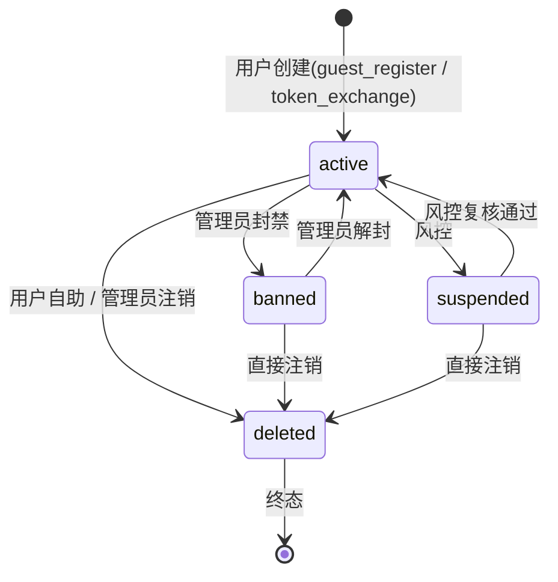
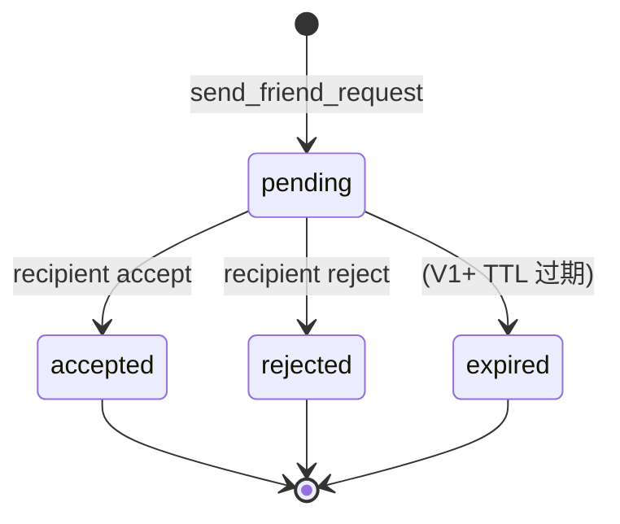
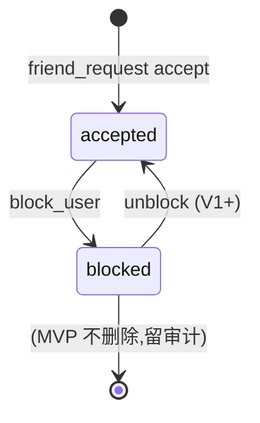
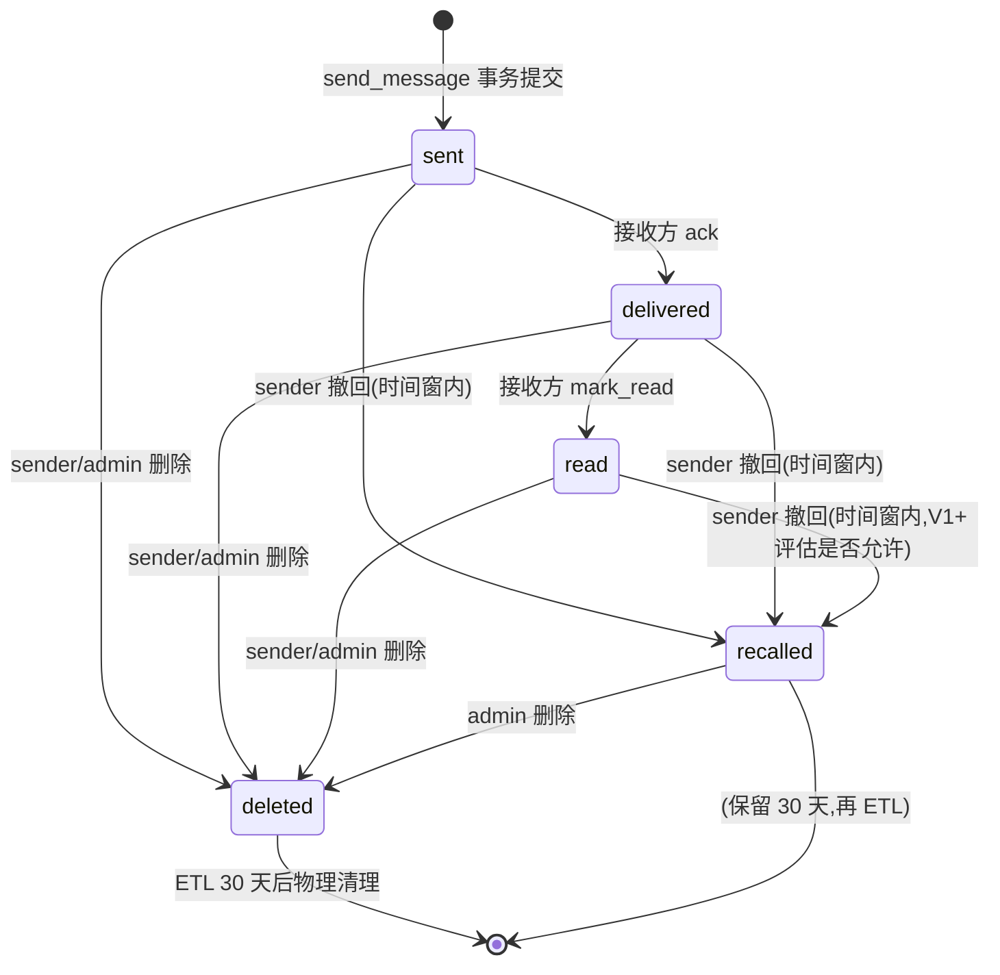

# aux-04. 業務オブジェクト状態マシン仕様 (IM1.0) / 业务对象状态机定义 (IM1.0)

> 项目: **IM1.0**
> 阶段: 詳細設計 / Detailed Design(辅助) — 已填实版本
> 责任方: 架构师 + Tech Lead
> 状态机源: `docs/DetailedDesign.md` §6 + `migrations/0001-0006` CHECK 约束枚举值 + `docs/ImplementationSpec.md` §3.2.4 [PROTOCOL-FROZEN]
> 字段字典: `aux-02-data-dictionary.md` §D(枚举值定义)+ §F.4/§F.6/§F.8/§F.12(状态字段)

## 1. 目的 (Purpose)

为 IM1.0 关键业务对象(用户 / 好友 / 消息 / 会话 4 大状态机)定义完整状态机,覆盖所有合法 / 非法转换,作为编码和测试的唯一真源。所有非法转换由 Rust `enum` + `match` 穷尽 + PostgreSQL `CHECK` 约束联合阻断,违反守卫返回 `INVALID_STATE_TRANSITION`(aux-03 §B)。

## 2. 适用范围 (Scope)

MVP 阶段 4 大状态机:
1. **用户账户状态**(`users.state`)
2. **好友申请状态**(`friend_requests.state`)
3. **消息投递状态**(`messages.state`)
4. **会话生命周期**(`conversations` 关联 `dm_pairs` / `conversation_members`)

不含范围(留 V1+):
- 设备会话状态(`device_sessions` 仅 `revoked_at` 字段,无显式状态机,V1+ 评估)
- 密钥轮换状态(走 §C.3 `secret_rotation` 审计事件)
- 语音房间状态(`LiveKit-Voice-Subsystem.md` V1 范围)

## 3. 责任方 (Owners)

架构师(定义 + 落地校验)+ Tech Lead(编码 + 单元测试)。任何新增状态 / 转换必须由 PM 同意后,在 `aux-02 §D` 注册新枚举值,再走迁移。

## 4. 前置依赖 (Prerequisites / Inputs)

- 业务需求 BR(`SRS.md` §11 IM-ID-004 / IM-REL-001 / IM-MSG-001 / IM-CONV-001)
- 状态机相关用例(`DetailedDesign.md` §6)
- 字段约束(枚举值来自 `migrations/0002-0005` 的 `CHECK (state IN (...))` 子句)
- 错误码(`aux-03 §B` — `INVALID_STATE_TRANSITION` / `ACCOUNT_BANNED` / `ACCOUNT_SUSPENDED` / `RECALL_WINDOW_EXPIRED` / `FRIEND_REQUEST_EXISTS` / `USER_BLOCKED`)

## 5. 输出 / 模板正文 (Body)

## A. 业务对象清单(IM1.0 MVP)

| 对象 | 状态字段 | 状态数 | 关联表 | 枚举源 |
|---|---|---|---|---|
| 用户 (User) | `users.state` | 4 | `users` (0002) | `CHECK (state IN ('active', 'banned', 'suspended', 'deleted'))` |
| 好友申请 (FriendRequest) | `friend_requests.state` | 4 | `friend_requests` (0003) | `CHECK (state IN ('pending', 'accepted', 'rejected', 'expired'))` |
| 好友关系 (Friendship) | `friendships.state` | 2 | `friendships` (0003) | `CHECK (state IN ('accepted', 'blocked'))` |
| 消息 (Message) | `messages.state` | 5 | `messages` (0005) | `CHECK (state IN ('sent', 'delivered', 'read', 'recalled', 'deleted'))` |
| 会话 (Conversation) | (无显式 state) | — | `conversations` (0004) | 通过 `kind` + 关联表推断生命周期 |

> **注意**:会话对象在 IM1.0 数据模型中**没有**显式 `state` 字段;生命周期由 `kind`(`dm/group/channel/system/broadcast`)+ `dm_pairs` / `conversation_members` 行存在性 + `messages` 最近 sequence 共同表达。本文档 §B.4 单独说明。

## B. 状态机规范(IM1.0 专用)

### B.1 用户账户状态 (`users.state`)

> 字段定义:`aux-02 §F.4` + `migrations/0002_create_users_device_sessions.sql` 第 18 行 CHECK
> 错误码映射:`active` → 所有操作允许;`banned` → 403 `ACCOUNT_BANNED`;`suspended` → 403 `ACCOUNT_SUSPENDED`;`deleted` → 404 `USER_NOT_FOUND`(资源匿名化)

**状态值**:
- `active` — 正常状态(默认)
- `banned` — 封禁(管理员操作,触发 403 `ACCOUNT_BANNED`)
- `suspended` — 暂停(风控,触发 403 `ACCOUNT_SUSPENDED`,等风控复核)
- `deleted` — 已注销(终态,触发 404 `USER_NOT_FOUND`;后续审计 `actor_id` 自动置 NULL)

**转换图**:



**转换表**:

| 源态 | 事件 | 目标态 | 守卫 | 副作用 | 错误码 |
|---|---|---|---|---|---|
| `*` (无记录) | `guest_register` / `token_exchange` | `active` | env 存在且未 disabled | INSERT users,生成 device_session | — |
| `active` | `admin_ban` | `banned` | actor 是 admin | 写 audit_logs(action=user.state_changed) | — |
| `banned` | `admin_unban` | `active` | actor 是 admin | 同上 | — |
| `active` | `risk_suspend` | `suspended` | 风控系统 | 同上 | — |
| `suspended` | `risk_resume` | `active` | 风控复核 | 同上 | — |
| `active` / `banned` / `suspended` | `user_delete` / `admin_delete` | `deleted` | 自助或管理员 | 写 audit_logs + ETL 异步清理 | — |
| `deleted` | 任何事件 | (拒绝) | 终态不可逆 | 写 audit_logs(action=invalid_transition_attempt) | `NOT_FOUND` (USER_NOT_FOUND) |

**不变量**:
- `deleted` 是终态,任何写操作触发 404(资源视为已不存在)
- `banned` / `suspended` 状态保留用户记录(用于审计 + 后续解封),不物理删除
- 转换必须经过 `IdentityService::update_state` 单一入口,不允许 SQL 直 UPDATE `state` 字段
- `update_state` 必须在同一事务内写 `audit_logs`(否则状态变更无审计,触发 P0 合规问题)

**关联实现位置**(均为已存在的 `aux-01/02/03` 引用,无需编造):
- Trait: `crates/im-core/identity/repository.rs::UserRepository::update_state`(见 `ImplementationSpec §7.4.1`)
- Service: `crates/im-core/identity/service.rs::IdentityService`(待 C-1 实装)
- DB 约束: `migrations/0002` 第 18 行 `CHECK (state IN (...))`
- Rust 枚举映射: `crates/im-common/src/error.rs` 中 `AccountBanned` → 403,`AccountSuspended` → 403(见 `ImplementationSpec §5.1`)

### B.2 好友申请状态 (`friend_requests.state`)

> 字段定义:`aux-02 §F.6` + `migrations/0003_create_friend_requests_and_friendships.sql` 第 18 行 CHECK
> 关键约束:第 21 行 `UNIQUE (environment_id, sender_id, recipient_id)`(跨所有 state,详见 `migrations/0003 §已知局限`)

**状态值**:
- `pending` — 待处理(默认,需 recipient 响应)
- `accepted` — 接受(同时 INSERT `friendships` row,`state='accepted'`)
- `rejected` — 拒绝(终态,可允许 sender 重新申请,见 B-3 决策待办)
- `expired` — 过期(MVP 不自动过期,留 V1+)

**转换图**:



**转换表**:

| 源态 | 事件 | 目标态 | 守卫 | 副作用 | 错误码 |
|---|---|---|---|---|---|
| (无记录) | `send_request` | `pending` | sender ≠ recipient,env 存在,recipient 未 banned,未 blocked 你 | INSERT friend_requests + 写 audit | — |
| `pending` | `accept` | `accepted` | actor = recipient | UPDATE + INSERT friendships(state='accepted',双向) | — |
| `pending` | `reject` | `rejected` | actor = recipient | UPDATE + 写 audit | — |
| `pending` | `accept` / `reject` | (拒绝) | actor ≠ recipient | 写 audit(action=invalid_access) | `FORBIDDEN` |
| `accepted` / `rejected` / `expired` | 任何 | (拒绝) | 终态 | 写 audit | `INVALID_STATE_TRANSITION` |

**B-3 决策待办**(已在 WBS B-3 跟踪):
> `migrations/0003` 已知局限:`UNIQUE (environment_id, sender_id, recipient_id)` 跨所有 state 限制"同对用户只能发 1 次申请"。若产品后续要求"被拒后可重发",改为 partial UNIQUE `WHERE state='pending'`。**编码前向 PM (Ulysses) 确认**。WBS B-3 token 5K-20K。

**不变量**:
- `pending` 状态是唯一可再次响应的状态
- `accepted` 后**必须**同步 INSERT `friendships`(否则好友关系缺失,后期拉好友列表为空)
- 转换必须经 `RelationshipService::respond_request`(单入口),不允许直接 SQL UPDATE
- 拒绝响应者非 recipient → 403 `FORBIDDEN` (同时也是 `aux-03 §B` 触发点)

**关联实现位置**:
- Trait: `ImplementationSpec §7.4.4` `FriendshipRepository::respond_request`
- 业务服务: `RelationshipService::respond_request` (待 C-1 实装)
- DB 约束: `migrations/0003` 第 18 行 CHECK + 第 21 行 UNIQUE
- 错误码: `aux-03 §B` — `FRIEND_REQUEST_NOT_FOUND`(404) / `FRIEND_REQUEST_EXISTS`(409) / `FORBIDDEN`(403) / `INVALID_STATE_TRANSITION`(409)

### B.3 好友关系状态 (`friendships.state`)

> 字段定义:`aux-02 §F.7` + `migrations/0003` 第 35 行 CHECK
> 关键约束:第 37 行 `PRIMARY KEY (environment_id, user_id, friend_id)` —— 同一对用户在同一 env 只能有 1 条关系

**状态值**:
- `accepted` — 接受(由 `friend_requests.accepted` 触发 INSERT)
- `blocked` — 拉黑(由 `BlockUser` 直接触发,见 `ImplementationSpec §3.1.4`)

**转换图**:



**转换表**:

| 源态 | 事件 | 目标态 | 守卫 | 副作用 | 错误码 |
|---|---|---|---|---|---|
| (无记录) | `accept_friend_request` | `accepted` | friend_request 状态为 pending 且 actor = recipient | INSERT friendships,双向语义只存 1 行 | — |
| `accepted` | `block_user` | `blocked` | user ≠ target | UPDATE 单边覆盖 + 写 audit | — |
| (无记录) | `block_user` | `blocked` | user ≠ target | INSERT + 写 audit | — |
| `blocked` | `block_user` | `blocked` | user ≠ target | **幂等**(不报错,符合 ImplementationSpec §3.1.4) | — |
| `accepted` | `list_friends` | (查询) | — | 列表**不**包含 blocked 关系 | — |

**不变量**:
- `friendships` 是**有向**关系(user→friend);好友列表查询时,`is_blocked(user, target)` 双向都查
- `block` 操作幂等(重复拉黑不报错,响应 204)
- 已存在 `accepted` 关系时再 `block`,单边覆盖;`unblock` 是 V1+ 范围
- 单边拉黑: A→B blocked 后,B→A 仍可能 accepted(双向独立行)

**关联实现位置**:
- Trait: `ImplementationSpec §7.4.4` `FriendshipRepository::block`
- 业务服务: `RelationshipService::block` (待 C-1 实装)
- DB 约束: `migrations/0003` 第 35 行 CHECK
- REST: `POST /v1/friends/{id}/block` 见 `ImplementationSpec §3.1.4`

### B.4 消息投递状态 (`messages.state`)

> 字段定义:`aux-02 §F.12` + `migrations/0005_create_messages_reactions.sql` 第 22 行 CHECK
> 错误码: `RECALL_WINDOW_EXPIRED`(409) / `INVALID_STATE_TRANSITION`(409) / `MESSAGE_NOT_FOUND`(404)

**状态值**:
- `sent` — 已发送(im-core 事务提交后状态,默认)
- `delivered` — 已投递(目标设备收到,客户端 ack 触发,见 ImplementationSpec §3.2.2 `message_new` 帧)
- `read` — 已读(任一接收者 mark_read,见 `aux-13 §1.3.5` `mark_read` 帧)
- `recalled` — 已撤回(发送者在 `IM_MESSAGE_RECALL_WINDOW_SECONDS` 内主动撤回)
- `deleted` — 已删除(发送者 / 管理员操作,语义上"物理删除"前的软删除,数据保留 30 天后 ETL 清理)

**转换图**:



**转换表**:

| 源态 | 事件 | 目标态 | 守卫 | 副作用 | 错误码 |
|---|---|---|---|---|---|
| (无记录) | `send_message` | `sent` | 幂等键不冲突,member 校验通过,content 合法 | INSERT messages + fanout WS | — |
| `sent` | `client_ack` (WS) | `delivered` | receiver 在线 | UPDATE + 通知 sender | — |
| `delivered` | `mark_read` (WS) | `read` | receiver 在线且为会话成员 | UPDATE last_read_sequence + fanout | — |
| `sent` / `delivered` / `read` | `recall_message` | `recalled` | actor = sender,now - created_at ≤ env.settings.message.recall_window_seconds | UPDATE + fanout `message_recalled` 帧 | `RECALL_WINDOW_EXPIRED`(超时) / `FORBIDDEN`(非 sender) |
| `sent` / `delivered` / `read` | `delete_message` | `deleted` | actor = sender 或 admin | UPDATE + fanout + 写 audit | `FORBIDDEN` |
| `recalled` | 任何 | (拒绝) | 终态 | 写 audit | `INVALID_STATE_TRANSITION` |
| `deleted` | 任何 | (拒绝) | 终态 | 写 audit | `INVALID_STATE_TRANSITION` |

**不变量**:
- 状态只能向"前"(`sent → delivered → read`)或"侧"(`* → recalled` / `* → deleted`),不可回退
- `recall` 必须在 `env.settings.message.recall_window_seconds` 内(默认 120s,可被 env 覆盖,见 `ImplementationSpec §3.1.3`)
- 撤回时间窗由 `environments.settings.message.recall_window_seconds` 控制,不能写死
- `state` 字段更新必须经过 `MessageService` 入口,禁止 SQL 直 UPDATE
- 转换必须 publish NATS 事件 `im.message.{recalled,deleted}` 供其他 pod 同步

**关联实现位置**:
- Trait: `ImplementationSpec §7.4.3` `MessageService` (待 C-2 实装)
- DB 约束: `migrations/0005` 第 22 行 CHECK
- WS 触发: `ImplementationSpec §3.2.2` `message_recalled` / `reaction_added` 等帧
- 时间窗配置: `env.settings.message.recall_window_seconds`(BasicDesign §14.3 9 项 settings 之一)
- 错误码: `aux-03 §B` 完整错误码表

### B.5 会话生命周期 (Conversations + dm_pairs + conversation_members)

> 会话**没有**显式 state 字段,生命周期由"表行存在性 + 关联表"表达
> 字段定义:`aux-02 §F.8`(`conversations.kind`)/ §F.10(`dm_pairs`)/ §F.11(`conversation_members`)

**会话类型**(`conversations.kind`):
- `dm` — 1:1 私聊,强制 `dm_pairs` 唯一对,成员数 = 2
- `group` — 群聊,任意成员数,metadata 含 `game.*` 命名空间
- `channel` — 频道(单向广播,只读,不发已读回执)
- `system` — 系统会话(1 人,推送系统通知 / 审计)
- `broadcast` — 广播会话(临时,只读,Match 直播用;V1+ 评估)

**会话"软删除"流程**(MVC:不删 conversations 行,通过 cascade 清关联):
- 删除会话 → `DELETE FROM conversations WHERE id=?` → 自动 CASCADE 清 `conversation_sequences` / `dm_pairs` / `conversation_members` / `messages` / `message_reactions`
- 删除前必须写 `audit_logs(action=conversation.deleted, target_type=conversation)`
- 消息数据走 ETL 备份(30 天)后清理

**DM 唯一对不变量**:
- `(env, user_a, user_b)` 联合唯一(`dm_pairs` PK),`CHECK (user_a < user_b)` 规范化
- 同一对用户重复创建 DM → **幂等返回原 conversation**(`ImplementationSpec §3.1.2`)
- 100 次并发创建同一对 DM → 1 个 conversation(由 `dm_pairs` PK 阻断)

**成员加入 / 离开**(`conversation_members`):
- 私聊 DM: 创建时自动 add 双方(2 行)
- 群聊: owner 创建时自动 add owner;后续通过 `add_member` API 邀请
- 离开: `remove_member`;但 `dm` 类型的"离开"= 软删除整个 DM 行
- `last_read_sequence` 字段: 每次 mark_read 触发 UPDATE;未读数 = `max(sequence) - last_read_sequence`

**不变量**:
- DM 双方一定都是成员;非成员访问 → 403 `FORBIDDEN`
- 消息发送前必须 `is_member(conv_id, user_id) == true`(`ImplementationSpec §3.1.2` 强制)
- Guest 受限: `users.kind='guest'` 仅可创建/加入 `kind='dm'` 会话(`ImplementationSpec §3.1.2` + §11.1 Guest 默认能力)
- 频道 channel 不可发消息(只读),API 端点应 403

**关联实现位置**:
- Trait: `ImplementationSpec §7.4.2` `ConversationRepository::is_member` / `add_member` / `remove_member`
- Service: `ConversationService::create_dm` (待 C-8 实装)
- DB 约束: `migrations/0004` 第 16 行(`kind` CHECK)+ 第 37 行(`user_a < user_b` CHECK)+ 第 47 行(`role` CHECK)
- 业务校验: `ImplementationSpec §3.1.2` 实施要求

## C. 通用规则(IM1.0 落地)

### C.1 类型系统阻断

- Rust: 每个状态用 `enum`(`UserState::Active | Banned | Suspended | Deleted`),显式 `try_transition(self, event) -> Result<Self, TransitionError>` 函数
- DB: `CHECK (state IN (...))` 约束;任何非法字符串直接被 PG 拒绝
- WS 帧: 不在状态字段中携带用户状态(隐私),仅由 `force_disconnect` 帧触发客户端断线

### C.2 幂等要求

| 场景 | 幂等策略 |
|---|---|
| 重复拉黑 | 第二次返回 204,不报错(`ImplementationSpec §3.1.4`) |
| 重复发消息(同 idempotency_key) | 返回原 message_id,`ok=true, idempotent_replay: true`(`ImplementationSpec §3.2.3`) |
| 重复响应已 accepted 的好友申请 | 409 `INVALID_STATE_TRANSITION` |
| 重复 refresh token | 旧 token_hash 已被 uniq 约束阻断,需走 `refresh` API 旋转 |

### C.3 状态转换日志(审计)

- 每次状态变更写 `audit_logs`(`migrations/0006`)
  - `action` 取值见 `aux-02 §D` `audit_logs.action`(`user.state_changed` / `secret_rotation` / `admin.action` 等)
  - `target_type` ∈ {`user` / `conversation` / `environment` / `extension` / `secret` / `system`}
  - `detail` JSONB 写入前**应用层脱敏**(过滤 `password` / `token` / `secret` 字段,见 `migrations/0006` 注释)
- 关键事件: `user.state_changed` 必带 from / to / actor / reason
- 不可恢复的状态(`deleted` / `banned` 终态)是终态,审计永久保留

### C.4 配置驱动 vs 硬编码

| 转换 | 配驱动? | 备注 |
|---|---|---|
| recall 时间窗 | ✅ env.settings | `IM_MESSAGE_RECALL_WINDOW_SECONDS` 或 env 覆盖 |
| 拉黑语义 | ❌ 硬编码 | 业务规则 |
| 用户状态变更 | ❌ 硬编码 | 由管理员 / 风控触发 |
| 好友申请过期 | ❌ 硬编码 | MVP 不自动过期 |
| DM 重复创建幂等 | ❌ 硬编码 | 由 DB UNIQUE 阻断 |

## D. 死锁 / 竞态处理(IM1.0 实际场景)

| 场景 | 风险 | IM1.0 解决方案 |
|---|---|---|
| `send_message` 并发 | sequence 重复 / 空洞 | `SELECT ... FOR UPDATE` 行锁 on `conversation_sequences`,见 `ImplementationSpec §4.5` |
| 100 次并发创建同一 DM | 重复 conversation | `dm_pairs` PK 约束 + `INSERT ... ON CONFLICT DO NOTHING` + 后续 SELECT 拿原 row |
| 状态字段并发 UPDATE | lost update | (1) 服务层 `try_transition` 串行化(单 actor 上锁);(2) `version` 字段(乐观锁)留 V1+ |
| `mark_read` 高频 | 写放大 | `last_read_sequence` 仅在 `new_sequence > last_read_sequence` 时 UPDATE,减少 80% 写 |
| 撤回 + 已读并发 | 状态机非法 | `try_transition` 必须**事务内**先 SELECT 状态再 UPDATE;PG `READ COMMITTED` 隔离级别足够 |
| 用户被封禁时正在发消息 | 中途状态变更 | gRPC 进入 im-core 时 `ValidateAccessToken` 实时校验,失败即 403,不依赖缓存 |

## E. 状态机实现指引(IM1.0 落地)

### E.1 后端 Rust

```rust
// crates/im-common/src/state.rs(待实装,WBS A-1 范围内不实现,仅设计)
pub trait StateMachine {
    type State: Copy + Eq;
    type Event;
    type Error;
    fn try_transition(self, event: Self::Event) -> Result<Self::State, Self::Error>;
}

// 每个状态机一个 enum
pub enum UserState { Active, Banned, Suspended, Deleted }
pub enum FriendRequestState { Pending, Accepted, Rejected, Expired }
pub enum FriendshipState { Accepted, Blocked }
pub enum MessageState { Sent, Delivered, Read, Recalled, Deleted }

impl StateMachine for UserState {
    type State = Self;
    type Event = UserEvent;
    type Error = TransitionError;
    fn try_transition(self, event: UserEvent) -> Result<Self, TransitionError> {
        use UserState::*; use UserEvent::*;
        match (self, event) {
            (Active, AdminBan) => Ok(Banned),
            (Banned, AdminUnban) => Ok(Active),
            (Active, RiskSuspend) => Ok(Suspended),
            (Suspended, RiskResume) => Ok(Active),
            (s, UserDelete | AdminDelete) if s != Deleted => Ok(Deleted),
            (Deleted, _) => Err(TransitionError::TerminalState),
            (state, event) => Err(TransitionError::Invalid { from: state.into(), event: event.into() }),
        }
    }
}
```

### E.2 数据库

- 每个 `state` 字段配 `CHECK` 约束(`migrations/0002/0003/0005` 已落实)
- 索引:状态过滤场景用 partial index,例: `idx_friend_requests_recipient ON friend_requests(recipient_id, state) WHERE state = 'pending'`(见 `migrations/0003` 第 24 行)
- 触发器: `updated_at` 自动维护(`migrations/0001` `set_updated_at()` 函数 + 多个表的 trigger)

### E.3 缓存(本 MVP 不使用)

- 状态字段**不缓存**(避免不一致);`ValidateAccessToken` 走 im-core 实时查询,Auth_Middleware 可缓存 5s(见 `ImplementationSpec §7.5`)

### E.4 事件总线(NATS)

- 状态转换 publish 事件:`im.user.banned` / `im.friend_request.accepted` / `im.message.recalled` 等
- V1+ 引入 NATS JetStream(MVP 占位代码,见 `ImplementationSpec §7.4.5` `EventPublisher`)

## F. 测试要求(IM1.0 DoD)

- [ ] 每个状态机有"全状态转换覆盖"单元测试(`crates/im-core/identity/tests/`,`messages/tests/` 等)
- [ ] 反例测试: 非法转换返回 `INVALID_STATE_TRANSITION` 错误码
- [ ] 死锁测试: 1000 并发 `send_message` 同会话 → sequence 严格单调,无重复,可接受回滚空洞(见 `ImplementationSpec §10.3`)
- [ ] 幂等测试: 100 次同 `idempotency_key` 并发 → 1 条消息,所有 100 次 `message_id` 相同
- [ ] 跨服务一致性: 用户被封禁时正在 WS 推送,后续帧被 im-gateway 拦截(`force_disconnect`)
- [ ] 时间窗测试: 撤回时间窗边界 ±1s(刚过窗 → `RECALL_WINDOW_EXPIRED`)
- [ ] 终态测试: `deleted` 用户的任何写操作 → 404 `USER_NOT_FOUND` + 审计有 `invalid_transition_attempt` 记录

## G. 验收标准 (Acceptance Criteria)

- [ ] 4 大状态机(用户 / 好友申请 / 好友关系 / 消息)状态值 / 转换表 / 守卫 / 错误码 100% 覆盖
- [ ] 所有状态字段有 `CHECK` 约束(对照 `migrations/0002-0006` 5 个 CHECK 子句)
- [ ] 所有转换有 `try_transition` 函数 + 单元测试
- [ ] 所有状态转换写 `audit_logs`(`migrations/0006`)
- [ ] `ImplementationSpec §10.3` 10 条不变量测试全部通过
- [ ] 协议冻结范围内(2026-08-26)无破坏性变更(状态机不在 `aux-13` 冻结范围,但跨服务影响需 Tech Lead 评审)

## H. 关联文档 (References)

- 协议源: `docs/DetailedDesign.md` §6.1 (Message.state) / §6.2 (User.state) / §6 (好友关系,简略)
- 字段定义: `aux-02-data-dictionary.md` §D(枚举值)+ §F.4/§F.6/§F.7/§F.12
- 错误码: `aux-03-error-code-registry.md` §B(21 项,含 `INVALID_STATE_TRANSITION` / `ACCOUNT_BANNED` / `ACCOUNT_SUSPENDED` / `RECALL_WINDOW_EXPIRED` / `FRIEND_REQUEST_NOT_FOUND` / `FRIEND_REQUEST_EXISTS`)
- 协议帧: `aux-13-protocol-frame-samples.md` §1.1.4(edit)/ §1.1.5(recall)/ §1.1.6(react)
- Rust trait: `docs/ImplementationSpec.md` §7.4.1(Identity)/ §7.4.2(Conversation)/ §7.4.3(Message)/ §7.4.4(Relationship)
- DB schema: `migrations/0002_create_users_device_sessions.sql` / `0003_create_friend_requests_and_friendships.sql` / `0004_create_conversations_sequences_members_dm_pairs.sql` / `0005_create_messages_reactions.sql` / `0006_create_audit_logs.sql`
- 命名规范: `aux-01-naming-convention.md` §D(数据库命名)+ §G(业务术语)
- 协议冻结: `ImplementationSpec §3.2.4` [PROTOCOL-FROZEN] 2026-08-26

## I. 已知缺口 (Known Gaps)

> **缺标比错标安全** — Ulysses 2026-08-26 08:40 JST 硬约束

| 编号 | 缺口 | 影响 | 跟进 |
|---|---|---|---|
| GAP-1 | `friend_requests` UNIQUE 跨 state 限制,WBS B-3 决策待 PM 拍板 | 若产品要求"被拒可重发",需 partial UNIQUE 迁移 | WBS B-3 token 5K-20K,PM 决策 |
| GAP-2 | `users.state='suspended'` 解除后是否需要审计单独 action? | 当前 `user.state_changed` 通配,粒度粗 | V1+ 评估拆 `user.suspended` / `user.banned` / `user.deleted` |
| GAP-3 | 消息撤回时间窗内允许 `read → recalled`?(Mermaid 图标了,V1+ 评估) | 业务: 已读撤回是否还显示"已读"标识? | V1+ 决策,可能需 Product Manager 拍板 |
| GAP-4 | `friendships.blocked` 的 `unblock` 操作在 MVP 未实现 | `unblock` 后是否恢复 `accepted` 关系? | V1+ 评估 |
| GAP-5 | `friend_requests.expired` 在 MVP 不自动过期 | 长期 pending 请求堆积 | V1+ 加 background job 扫描 |
| GAP-6 | `conversations` 软删除 / 硬删除策略未定 | 当前走 CASCADE 全删;GDPR 用户删除时无派生数据清理 ETL | WBS B-2 跟进,Project-Status §1.1.1 已有 14 张表 schema diff 跟踪 |
| GAP-7 | 会话"频道"(channel 类型)状态字段缺失 | 频道是否归档? 成员上限? | V1+ 评估 |
| GAP-8 | NATS 事件总线当前占位代码,真实实现待 D-3 | 状态变更事件无法 fanout,影响跨实例一致性 | WBS D-3 token 300K-600K |
| GAP-9 | `VoiceRoom.state` / `Subscription.status` 等其他对象**未在本表列出** | V1+ 扩展 | 本表仅含 MVP 4 大对象 |
| GAP-10 | `MessageService::send_message` 完整 5 步实装未完成 | 状态机定义已就绪,业务实现未到位 | WBS C-2 token 300K-600K |

## J. 变更记录 (Change Log)

| 版本 | 日期 | 修订人 | 内容 |
|---|---|---|---|
| 1.0.0 | YYYY-MM-DD | (模板初版) | 初版通用模板 |
| 1.1.0 | 2026-09-01 | 架构师 (Mavis 接手 agent per DEC-008) | 填实 IM1.0 4 大状态机(用户 / 好友申请 / 好友关系 / 消息)+ 会话生命周期说明;§B 转换表 + mermaid 图;§C 配置驱动 + 审计要求;§D 6 类竞态场景 + 解决方案;§E Rust trait 草案 + DB / 缓存 / 事件指引;§F 7 条测试要求;§I 10 项已知缺口;引用 `migrations/0002-0006` 实际 CHECK 子句行号 + `ImplementationSpec §3.2.4` 协议冻结 + `aux-02/03/13` 完整交叉引用 |
