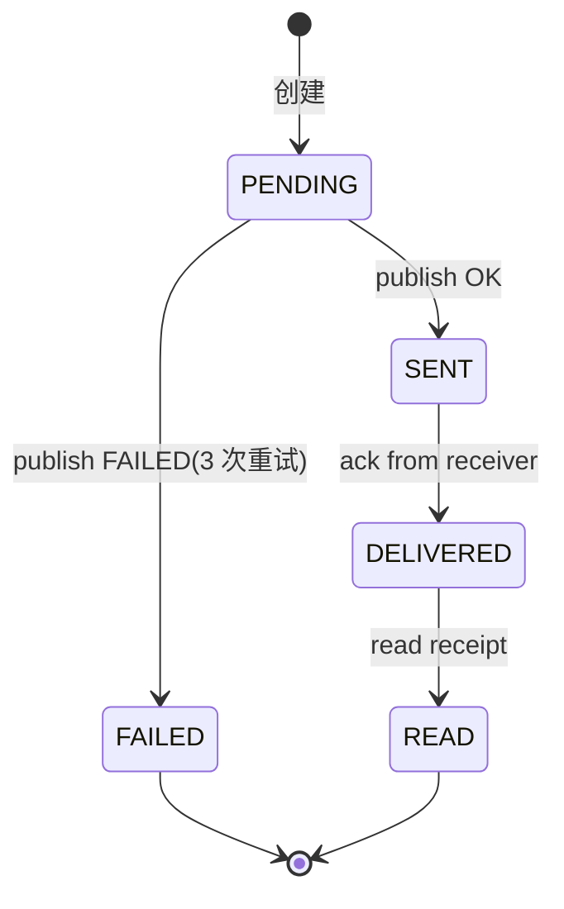

# aux-04. 業務オブジェクト状態マシン仕様 / 业务对象状态机定义

> 项目: **IM1.0**
> 阶段: 詳細設計 / Detailed Design(辅助)
> 责任方: BA + Tech Lead

## 1. 目的 (Purpose)

为关键业务对象定义完整的状态机,覆盖所有合法 / 非法转换,作为编码和测试的唯一真源。

## 2. 适用范围 (Scope)

用户、消息、房间、订单、订阅等关键业务对象。

## 3. 责任方 (Owners)

BA + Tech Lead

## 4. 前置依赖 (Prerequisites / Inputs)

- 业务需求 BR(11)
- 状态机相关用例

## 5. 输出 / 模板正文 (Body)

## A. 业务对象清单

| 对象 | 状态字段 | 状态数 | 关联表 |
|---|---|---|---|
| 用户(User) | status | 3 | users |
| 消息(Message) | delivery_status | 4 | messages |
| 房间(Room) | state | 4 | chat_rooms |
| 语音房间(VoiceRoom) | state | 5 | voice_rooms |
| 订阅(Subscription) | status | 3 | subscriptions |
| 任务(Job) | state | 6 | jobs |

## B. 状态机规范

### B.1 消息投递状态 (Message.delivery_status)

**状态值**:
- `PENDING` — 已创建,等待发送
- `SENT` — 已发送(到 IM Core)
- `DELIVERED` — 已投递(到目标设备)
- `READ` — 已读
- `FAILED` — 失败(永久)

**转换图** (mermaid):

**转换表**:

| 源态 | 事件 | 目标态 | 守卫 | 副作用 |
|---|---|---|---|---|
| PENDING | publish_ok | SENT | 重试 ≤ 3 | 触发推送 |
| PENDING | publish_fail | FAILED | 重试 > 3 | 记录失败原因 |
| SENT | ack_received | DELIVERED | sender == receiver | 更新 read_at |
| DELIVERED | read_receipt | READ | within 30d | 业务侧标记已读 |

**不变量**:
- 同一消息的状态只能向前 / 失败,不可回退
- 超过 30 天的消息不可再更新

### B.2 房间状态 (Room.state)

(类似结构)

### B.3 语音房间 (VoiceRoom.state)

| 状态 | 含义 | 进入事件 | 退出事件 |
|---|---|---|---|
| `IDLE` | 空闲 | 创建 | first user join |
| `ACTIVE` | 进行中 | first user join | last user leave |
| `PAUSED` | 暂停(管理员) | admin pause | admin resume |
| `CLOSED` | 关闭 | admin close | — |

## C. 通用规则

- 所有状态转换必须**幂等**(同样的源态 + 同样的事件,结果一致)
- 状态字段必须用**枚举类型**(类型系统阻断非法值)
- 状态转换日志:记录 from / to / event / actor / time
- 不可恢复的状态(如 `CLOSED`)是终态
- 状态字段变更走数据库迁移 + 双写

## D. 状态机实现指引

- **后端**:`enum` + 显式 `transition()` 函数,违反守卫返回错误码
- **数据库**:`CHECK` 约束 + `ENUM` 类型
- **缓存**:不缓存状态字段(避免不一致)
- **事件**:每次状态变化发领域事件 → 事件总线

## E. 死锁 / 竞态处理

- 用乐观锁:`version` 字段 + CAS
- 用悲观锁:高竞争场景(语音房间加入)
- 用分布式锁(Redis):跨服务状态协调

## F. 测试要求

- 每个状态机必须有"全状态转换覆盖"测试
- 反例测试:非法转换返回错误码
- 死锁测试:并发状态变更不导致数据不一致

## 6. 验收标准 (Acceptance Criteria)

所有关键业务对象有完整状态机;非合法转换被类型系统 / 数据库 CHECK 阻断;状态变更日志可追溯。

## 7. 关联文档 (References)

- 关联工程活动: 11 业务要件, 44 类设计, 50 错误处理
- 上游 Workflow: `docs/Workflow.md` Phase 4

## 8. 变更记录 (Change Log)

| 版本 | 日期 | 修订人 | 内容 |
|---|---|---|---|
| 1.0.0 | YYYY-MM-DD | (待定) | 初版 |
