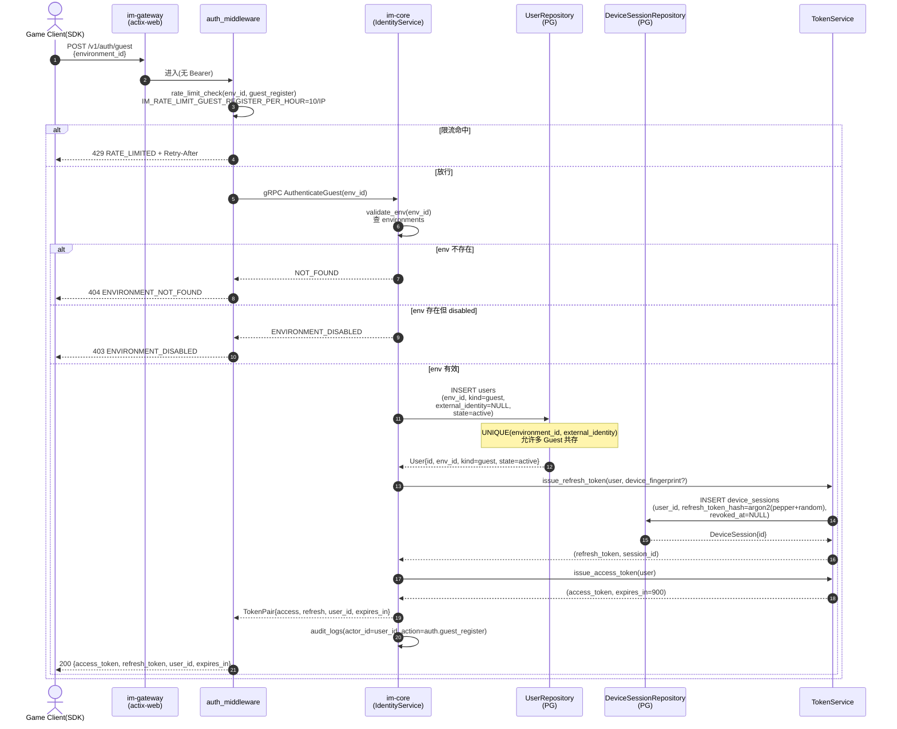
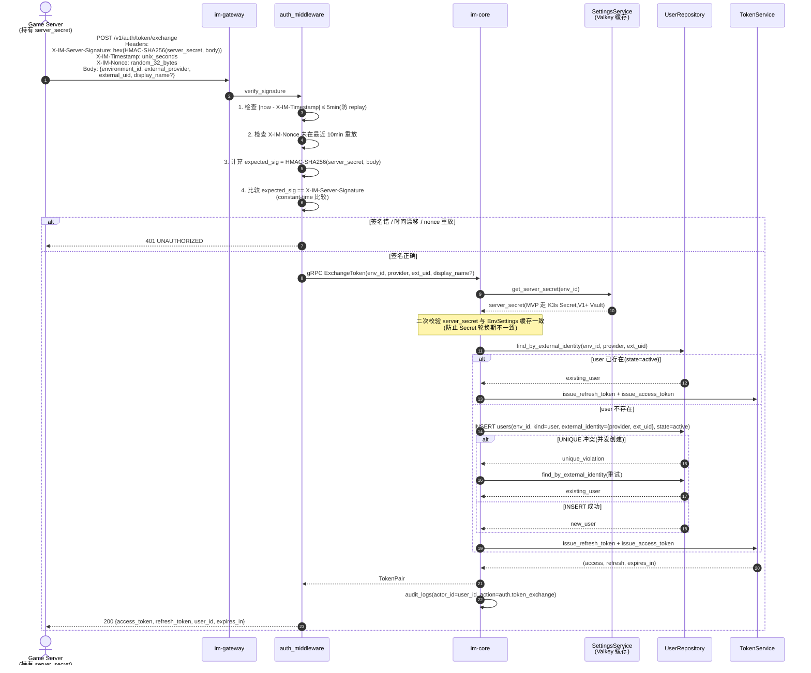
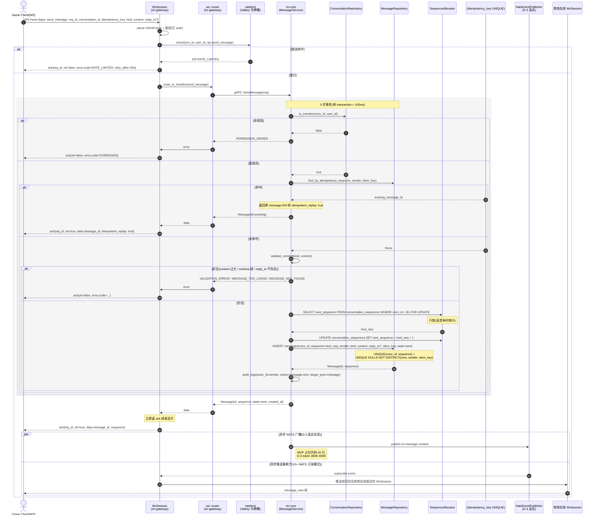
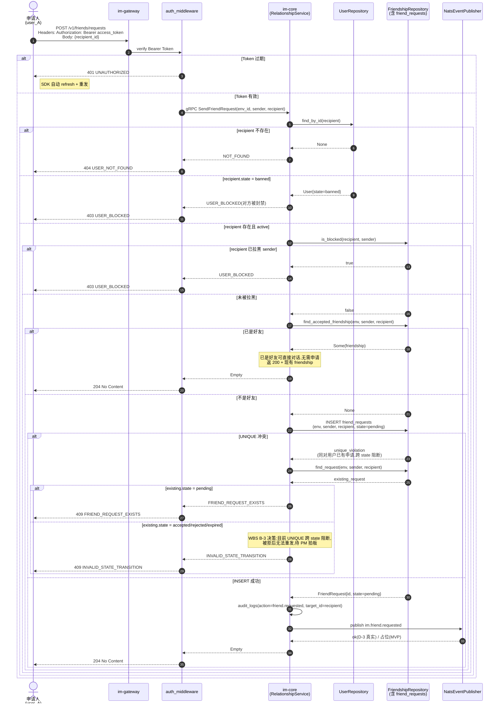
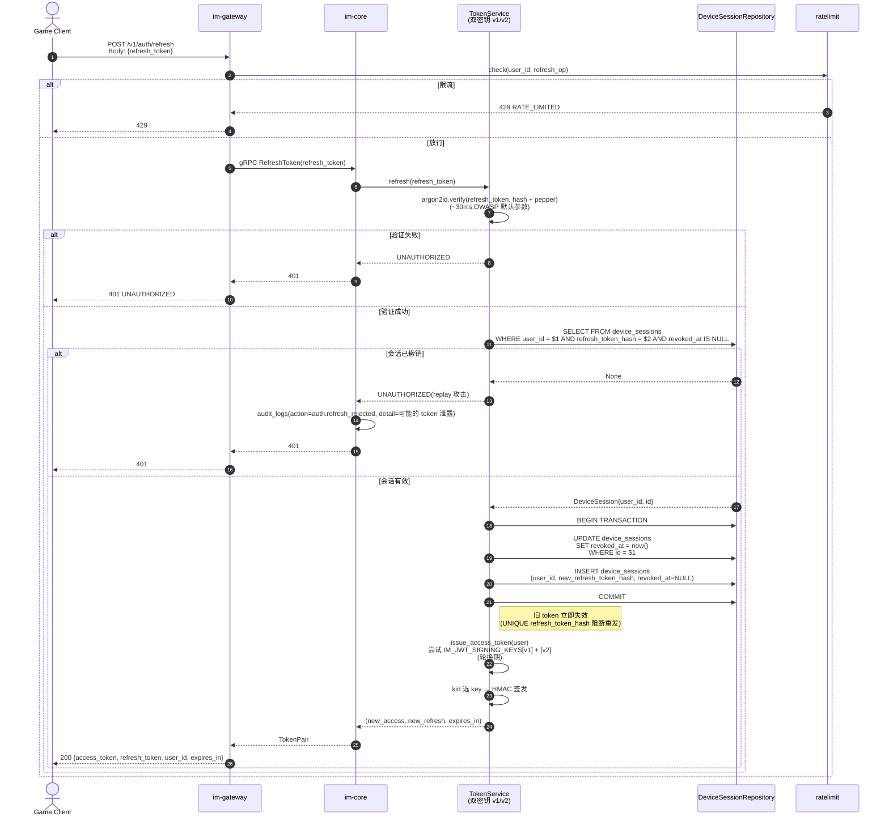
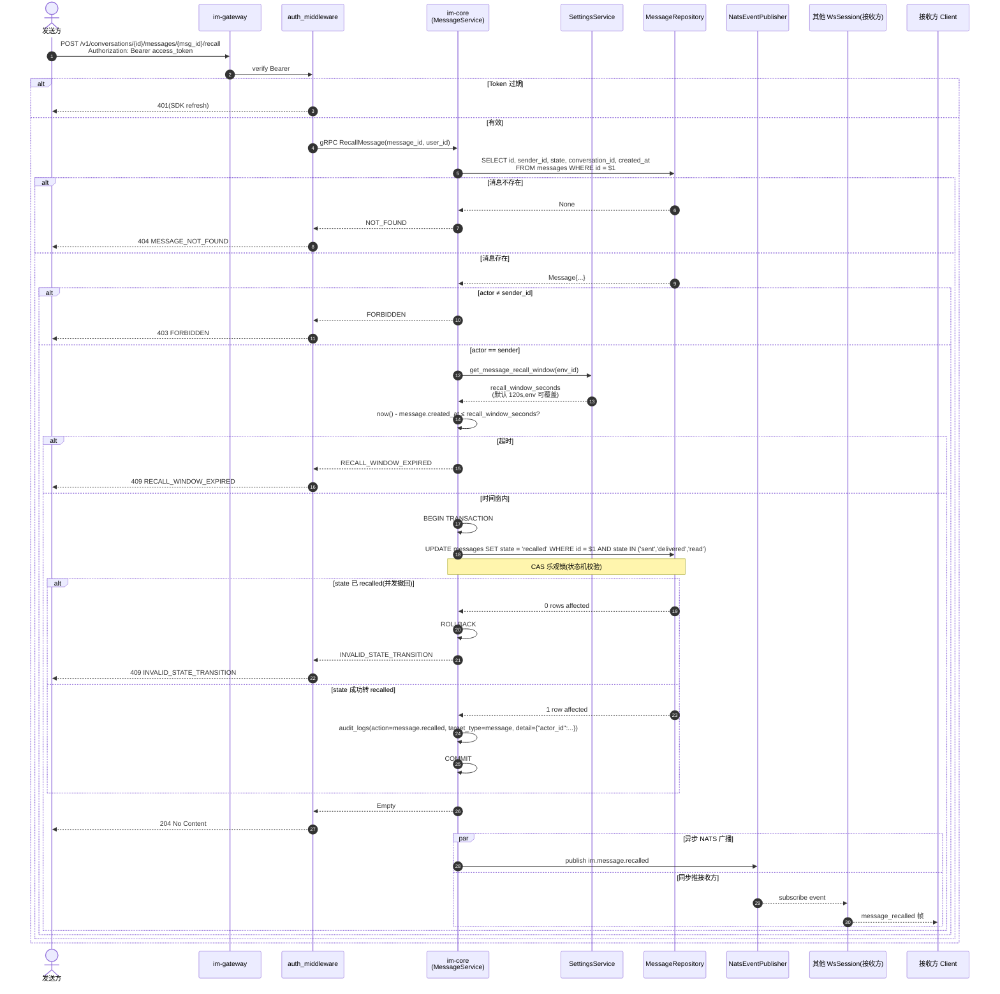
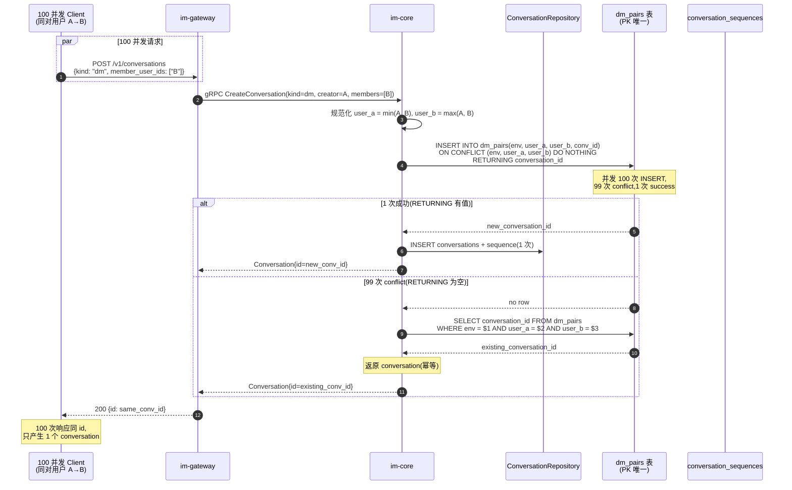
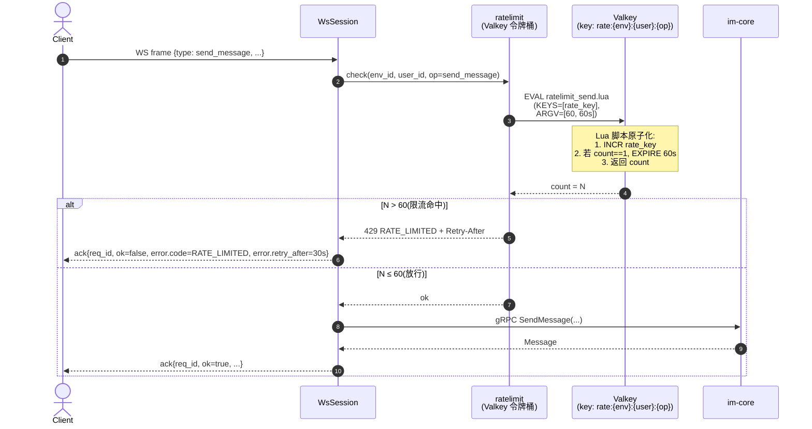

# aux-11. 重要業務シナリオ時系列図集 (IM1.0) / 关键场景时序图集 (IM1.0)

> 项目: **IM1.0**
> 阶段: 詳細設計 / Detailed Design(辅助) — 已填实版本
> 责任方: 架构师
> 协议源: `docs/ImplementationSpec.md` §3.1(REST 26 端点)+ §3.2(WS 12 帧)+ §3.3(gRPC 22 RPC)
> 业务流源: `aux-04 §B`(4 大状态机)+ `aux-05 §5`(4 CRC 卡)+ `aux-13 §1`(WS 帧样例)
> DB: `migrations/0001-0006`

## 1. 目的 (Purpose)

用 mermaid 时序图固化 IM1.0 关键业务场景(register / login / send_message / add_friend 4 个核心场景),作为跨团队沟通和代码评审的参照,新场景加入时需评审通过后追加。

## 2. 适用范围 (Scope)

| 场景类型 | IM1.0 范围 |
|---|---|
| 核心业务 | 鉴权 / 消息 / 好友(本表 §1-§4) |
| 关键故障 / 异常 | Token 过期 / 撤回时间窗 / DM 重复创建 / 限流命中(本表 §5-§8) |
| V1+ 扩展 | 语音房间 / Presence / Extension 沙箱(留 §9 占位) |

## 3. 责任方 (Owners)

架构师(定义 + 更新)+ Tech Lead(评审 + 落地)。新场景需 2 人之一 + PM 同意。

## 4. 前置依赖 (Prerequisites / Inputs)

- 协议: `ImplementationSpec §3` + `aux-13 §1-§3`
- 状态机: `aux-04 §B`
- 字段: `aux-02 §F`
- 错误码: `aux-03 §B`
- CRC: `aux-05 §5`
- 性能: `aux-06 §B`

## 5. 输出 / 模板正文 (Body)

## 1. Register(Guest 注册)时序图

> 对应 REST `POST /v1/auth/guest`(`ImplementationSpec §3.1.1`)+ Rust trait `IdentityService::guest_register`(`ImplementationSpec §7.4.1`)

**关键校验**:
- `environment_id` 必须在 `environments` 表存在
- `state` 默认 'active'(`migrations/0002` 第 18 行)
- `kind='guest'` + `external_identity=NULL` 联合 UNIQUE 允许多 Guest(`aux-04 §B.1`)
- 写 `audit_logs`(`aux-08 §H`)

**失败处理**:
- 限流:`aux-09 §D.5` 限流命中查询
- env 不存在:返 404(无错误码注册,需评估加 `ENVIRONMENT_NOT_FOUND`)
- 写 DB 失败:整体回滚,返 500 `INTERNAL_ERROR`

**关联 commit**: 协议冻结 [PROTOCOL-FROZEN] (`12c7662`)

---

## 2. Login(Server-to-Server Token Exchange)时序图

> 对应 REST `POST /v1/auth/token/exchange`(`ImplementationSpec §3.1.1` 第 2 段 HMAC 校验)+ Rust trait `IdentityService::server_exchange_token`(`ImplementationSpec §7.4.1`)

**关键校验**(3 重防 replay + 1 重身份):
- HMAC 签名:用 `im-core` Secret 校验 client 签名
- Timestamp:与服务端时间差 > 5min 拒绝
- Nonce:服务端记录最近 10min nonce,重放拒绝
- 身份查重: `(env_id, external_identity)` UNIQUE 索引(`migrations/0002` 第 23 行)

**失败处理**:
- 签名错 / replay → 401 `UNAUTHORIZED` + 审计(可能攻击)
- 并发 INSERT → `ON CONFLICT` 处理或 retry 1 次
- secret 轮换期:7 天观察期(`ImplementationSpec §6.4` + `aux-06 §B A-010`)

**关联 commit**: 协议冻结 [PROTOCOL-FROZEN] (`12c7662`) + 密钥轮换 (POC-03)

---

## 3. Send Message(WebSocket 5 步)时序图

> 对应 WS `send_message` 帧(`aux-13 §1.1.2`)+ Rust trait `MessageService::send_message` 5 步(`ImplementationSpec §4.5` + §7.4.3 + `aux-06 §B A-003`)

**5 步关键流程**(`ImplementationSpec §4.5` + `aux-06 §B A-003/A-004`):
1. 成员校验(`is_member` + `FORBIDDEN`)
2. 幂等键查重(`find_by_idempotency_key` + UNIQUE 索引)
3. 分配 sequence(行锁 `FOR UPDATE`)
4. INSERT messages
5. NATS publish / WS fanout

**关键校验**:
- 限流:60 msg/min/user(`IM_RATE_LIMIT_SEND_MESSAGE_PER_MIN`)
- 内容:`content` 按 `kind` 校验 schema(`aux-13 §4.1`)
- 大小:`IM_MESSAGE_MAX_SIZE_BYTES` ≤ 64KB
- reply_to:存在性校验
- 顺序:`sequence` 严格单调(行锁保证)

**失败处理**:
- 限流 → 429 `RATE_LIMITED` + `Retry-After`
- 非成员 → 403 `FORBIDDEN`
- 重复 idempotency_key → 200 `idempotent_replay: true`(视为成功)
- 内容过大 → 400 `MESSAGE_TOO_LARGE`
- sequence 行锁超时 → 退避重试 3 次(`aux-08 §C`)

**关联 commit**: 协议冻结 [PROTOCOL-FROZEN] (`12c7662`)

---

## 4. Add Friend(好友申请)时序图

> 对应 REST `POST /v1/friends/requests`(`ImplementationSpec §3.1.4`)+ Rust trait `RelationshipService::send_request`(`ImplementationSpec §7.4.4`)

**关键校验**(6 重):
- 鉴权:Token 有效(否则 401,SDK refresh)
- recipient 存在
- recipient.state != banned(否则 403 `USER_BLOCKED`)
- recipient 未拉黑 sender(`is_blocked` 反向)
- 双方不是好友(避免重复申请)
- UNIQUE 约束:`(env, sender, recipient)` 跨 state(`migrations/0003` 第 21 行,已知限制 WBS B-3)

**失败处理**:
- 401:Token 过期,SDK 触发 refresh(自动)
- 404:recipient 不存在(用户可能注销)
- 403 `USER_BLOCKED`:对方被封禁或拉黑
- 409 `FRIEND_REQUEST_EXISTS`:已有待处理申请
- 409 `INVALID_STATE_TRANSITION`:已被接受/拒绝/过期,WBS B-3 决策

**B-3 决策待办**(per `132-wbs.md §B-3`):
> `friend_requests UNIQUE(env, sender, recipient)` 跨所有 state 限制,若产品要求"被拒可重发",改为 partial UNIQUE `WHERE state='pending'`。**PM 拍板 token 5K-20K**。

**关联 commit**: 协议冻结 [PROTOCOL-FROZEN] (`12c7662`)

---

## 5. Token Refresh(双密钥轮换期)时序图

> 对应 REST `POST /v1/auth/refresh`(`ImplementationSpec §3.1.1`)+ Rust trait `TokenService::refresh`(`ImplementationSpec §7.4.1` + `aux-06 §B A-002/A-010`)

**关键不变量**:
- 旋转:每次 refresh 旧 token 立即失效(`device_sessions.revoked_at`)
- 双密钥:7 天观察期,`IM_JWT_SIGNING_KEYS` 含 v1 + v2 两个 kid
- 重放检测:旧 refresh_token 重放 → revoked_at 非 NULL → 401 + 审计
- 失败次数计数:V1+ 加(单 user 1h 失败 > 10 → 临时锁 device_session,见 `aux-06 §B A-002` 优化策略)

**关联 commit**: 协议冻结 (`12c7662`) + POC-03 密钥轮换

---

## 6. Recall Message(撤回时间窗校验)时序图

> 对应 REST `POST /v1/conversations/{id}/messages/{msg_id}/recall`(`ImplementationSpec §3.1.3`)+ Rust trait `MessageService::recall_message`(`aux-04 §B.4` + `aux-08 §H.1` JOB-100)

**关键校验**:
- 鉴权 + 消息存在性
- 权限:actor 必须 = sender_id
- 时间窗:`env.settings.message.recall_window_seconds`(默认 120s)
- 状态机:CAS 乐观锁 `state IN ('sent', 'delivered', 'read')`(已 recalled → INVALID_STATE_TRANSITION)

**失败处理**:
- 401:Token 过期(SDK refresh)
- 404:消息不存在
- 403:非发送方
- 409 `RECALL_WINDOW_EXPIRED`:超时间窗
- 409 `INVALID_STATE_TRANSITION`:已 recalled(并发)

**幂等保证**(per `aux-08 §H.1`):
- 重复撤回(已 recalled)→ 409 `INVALID_STATE_TRANSITION`
- NATS 重复 publish(同 event_id)→ 消费者 60s 内去重

**关联 commit**: 协议冻结 (`12c7662`)

---

## 7. DM 重复创建幂等(并发 100 次)时序图

> 对应 REST `POST /v1/conversations`(`ImplementationSpec §3.1.2` + `aux-06 §B A-005`)

**关键不变量**(per `ImplementationSpec §10.3` 第 6 条):
- 同对用户 100 次并发创建 DM → 1 个 conversation
- 100 次响应同 `conversation_id`

**关键约束**(per `migrations/0004`):
- 第 35 行 `PRIMARY KEY (environment_id, user_a, user_b)` — 联合唯一
- 第 37 行 `CHECK (user_a < user_b)` — 强制 a < b
- 第 36 行 `UNIQUE (conversation_id)` — 一个 conversation 只对应一对

**失败处理**:
- 1 次成功 + 99 次 SELECT(走 PK 索引,O(1))
- 99 次 conflict 路径走 SELECT 而非 RETRY INSERT(避免死锁)

**关联 commit**: 协议冻结 (`12c7662`) + 集成测 `ImplementationSpec §10.3`

---

## 8. Rate Limit 命中时序图

> 对应 `IM_RATE_LIMIT_SEND_MESSAGE_PER_MIN=60`(`ImplementationSpec §11.3` + `aux-06 §B A-009`)

**关键参数**(`ImplementationSpec §11.3` + `aux-12 §A`):
- `IM_RATE_LIMIT_SEND_MESSAGE_PER_MIN=60` msg/min/user
- `IM_RATE_LIMIT_GUEST_REGISTER_PER_HOUR=10` 次/hour/IP
- `IM_RATE_LIMIT_TOKEN_EXCHANGE_PER_MIN=1000` 次/min/env
- `IM_RATE_LIMIT_BUCKET_SIZE=100` 全局 req/s/user

**关键优化**(V1+ 留):
- Lua 脚本原子化(避免 INCR + EXPIRE 2 次 RTT)
- 滑动窗口(替代固定窗口,避免边界 burst)
- 集群路由(单 key 在单 slot)

**失败处理**:
- 429 + `Retry-After` 头(30s)
- 客户端退避重试(指数退避 1s/2s/4s)
- 限流 hit 写 audit(`aux-08 §F`)

**关联 commit**: 协议冻结 (`12c7662`)

---

## 9. V1+ 时序图(占位,留 V1 实装后填)

| 场景 | V1+ 引用 |
|---|---|
| 语音房间加入(LiveKit) | `LiveKit-Voice-Subsystem.md` |
| Presence 上线 / 下线 | `aux-04 §B 扩展` + `im-presence` 真实实装 |
| Extension 沙箱启动 | `extension-runtime` 真实实装 |
| 媒体上传(预签名 + Multipart) | `im-media` S3 / MinIO |
| 密钥轮换(7 天观察期收尾) | `aux-06 §B A-010` POC-03 |
| 审计导出(合规) | `migrations/0006 audit_logs` + ETL |

---

## 维护规则

- **新增场景**:评审通过后追加(架构师 + Tech Lead 签字)
- **旧场景**:代码变更后必须更新对应图(PR 评审检查点)
- **评审**:每张图作为该场景编码的"必经"参照(`aux-10 §M` PR 模板引用)

## 验收标准 (Acceptance Criteria)

- [ ] 8 个 IM1.0 核心场景时序图(register / login / send_message / add_friend / refresh / recall / DM 幂等 / 限流)
- [ ] 每个时序图引用至少 3 个 aux 文档(状态机 / CRC / 错误码 / 协议帧)
- [ ] 每个时序图标注失败处理路径(alt / else)
- [ ] 关键约束引用 `migrations/0001-0006` 实际行号 + CHECK 子句
- [ ] 性能关键路径标注性能目标(参考 `aux-06 §B`)
- [ ] V1+ 场景显式标"占位",不编造未实装内容
- [ ] 与 `ImplementationSpec §3.2.4` 协议冻结范围一致
- [ ] mermaid 语法可被 GitHub / GitLab 渲染(autonumber + 注释 + alt/else/par)

## 关联文档 (References)

- 协议: `docs/ImplementationSpec.md` §3.1(REST)+ §3.2(WS)+ §3.3(gRPC)+ §3.2.4 [PROTOCOL-FROZEN]
- 协议帧: `aux-13-protocol-frame-samples.md` §1(WS 12 类)+ §3(REST 26 端点)
- 状态机: `aux-04-state-machine-spec.md` §B.1(users)/ §B.2(friend_requests)/ §B.4(messages)
- 字段: `aux-02-data-dictionary.md` §F.4 / §F.6 / §F.12
- 错误码: `aux-03-error-code-registry.md` §B(21 项)
- CRC: `aux-05-crc-card.md` §5(4 大核心类)
- 性能: `aux-06-algorithm-performance-model.md` §B A-001~A-013
- SQL: `aux-07-sql-optimization-checklist.md` §H
- 批处理: `aux-08 §H` JOB-100/101/102
- 日志: `aux-09 §D` 10 故障模式
- DD Review: `aux-10 §L` 历史评审
- 命名: `aux-01-naming-convention.md` §G
- 配置: `aux-12-config-spec.md`(待 WBS A-1 填实)
- DB schema: `migrations/0001-0006` + `aux-02 §F`
- 不变量: `ImplementationSpec §10.3` 10 条

## 已知缺口 (Known Gaps)

| 编号 | 缺口 | 影响 | 跟进 |
|---|---|---|---|
| GAP-1 | 8 个时序图未实装 Rust 代码,仅设计 | 当前 `crates/im-*/src/` 0 处 | WBS C-1..C-12 |
| GAP-2 | V1+ 6 个时序图(§9)仅占位,无 mermaid | 语音/Presence/Extension 等未实装 | WBS G-1..G-6 |
| GAP-3 | 时序图中 NATS publish 路径(D-3 真实)当前占位 | 事件总线未贯通 | WBS D-3 token 300K-600K |
| GAP-4 | §1 register 时序图未覆盖 `ENVIRONMENT_NOT_FOUND` 错误码注册 | 当前无此错误码,需评估加 | V1+ 评估 |
| GAP-5 | §2 login 二次校验 server_secret 与 EnvSettings 缓存一致性未在 ImplementationSpec 明确 | 轮换期可能不一致 | POC-03 实装时定 |
| GAP-6 | §3 send_message 时序图未覆盖 content JSON schema 校验失败细节 | 当前仅 "validate_content" 一步 | V1+ 拆细 |
| GAP-7 | §4 add_friend B-3 决策待 PM 拍板 | 跨 state UNIQUE 限制 | WBS B-3 token 5K-20K |
| GAP-8 | §5 refresh 失败次数计数 V1+ 加 | 当前无 brute force 防护 | V1+ `device_sessions` 加 `failed_attempts` 字段 |
| GAP-9 | §7 DM 100 并发测试当前为理论,MVP 未跑 | 性能基线未建立 | POC-01 跑后回填 |
| GAP-10 | §8 限流 Lua 脚本 MVP 未实装(占位 INCR + EXPIRE 2 次 RTT) | 极端情况 key 永驻 | V1+ 优化 |
| GAP-11 | 时序图未对应具体单元 / 集成测试文件 | 测试位置待实装定 | WBS C-1..C-12 |
| GAP-12 | §1-§8 时序图未标注 GATE(PR 合入 / 单测 / Smoke / 部署)对应阶段 | 实施路径不清 | V1+ 补 |

## 变更记录 (Change Log)

| 版本 | 日期 | 修订人 | 内容 |
|---|---|---|---|
| 1.0.0 | YYYY-MM-DD | (模板初版) | 初版通用模板(8 个泛化场景,无 IM1.0 实际引用) |
| 1.1.0 | 2026-09-01 | 架构师 (Mavis 接手 agent per DEC-008) | 填实 IM1.0 8 个核心场景时序图:§1 register(Guest)/ §2 login(Token Exchange 3 重防 replay)/ §3 send_message(WS 5 步)+ §4 add_friend(6 重校验)/ §5 refresh(双密钥轮换)/ §6 recall(时间窗 + 状态机 CAS)/ §7 DM 100 并发幂等 / §8 限流(Valkey 令牌桶);每个时序图引用 aux-04/05/06/07/08/09/13 + ImplementationSpec + migrations 实际行号;§9 V1+ 6 占位;§维护 + 验收 + 关联 + 12 已知缺口 |
