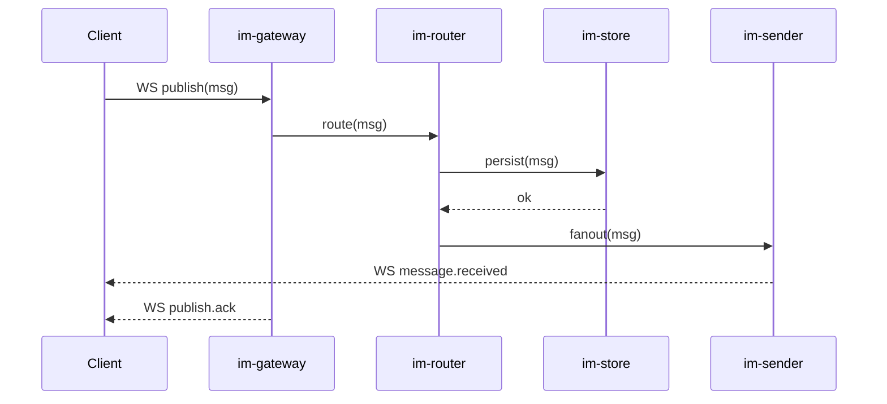
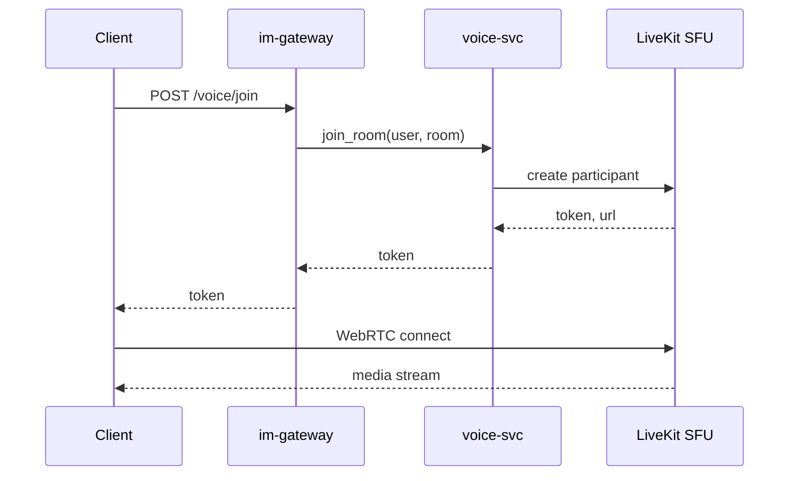
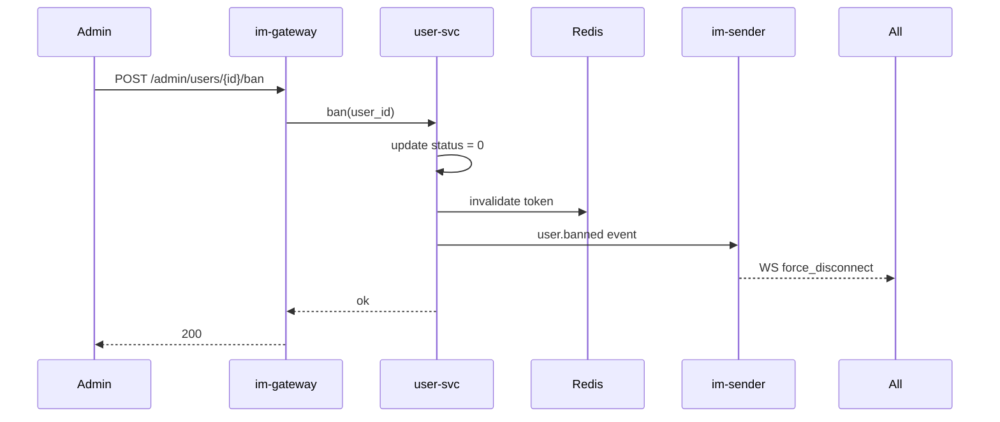
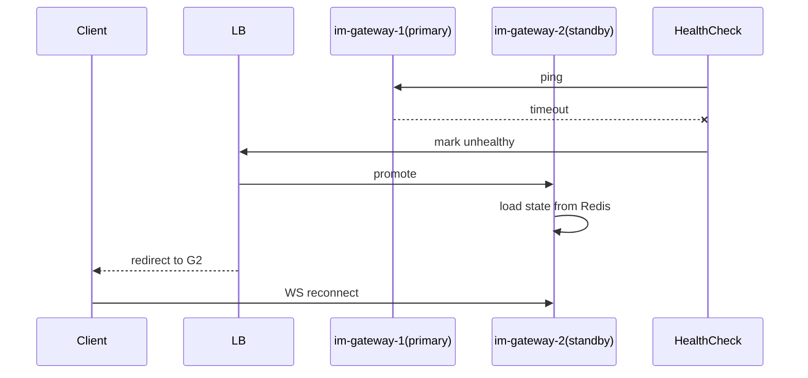
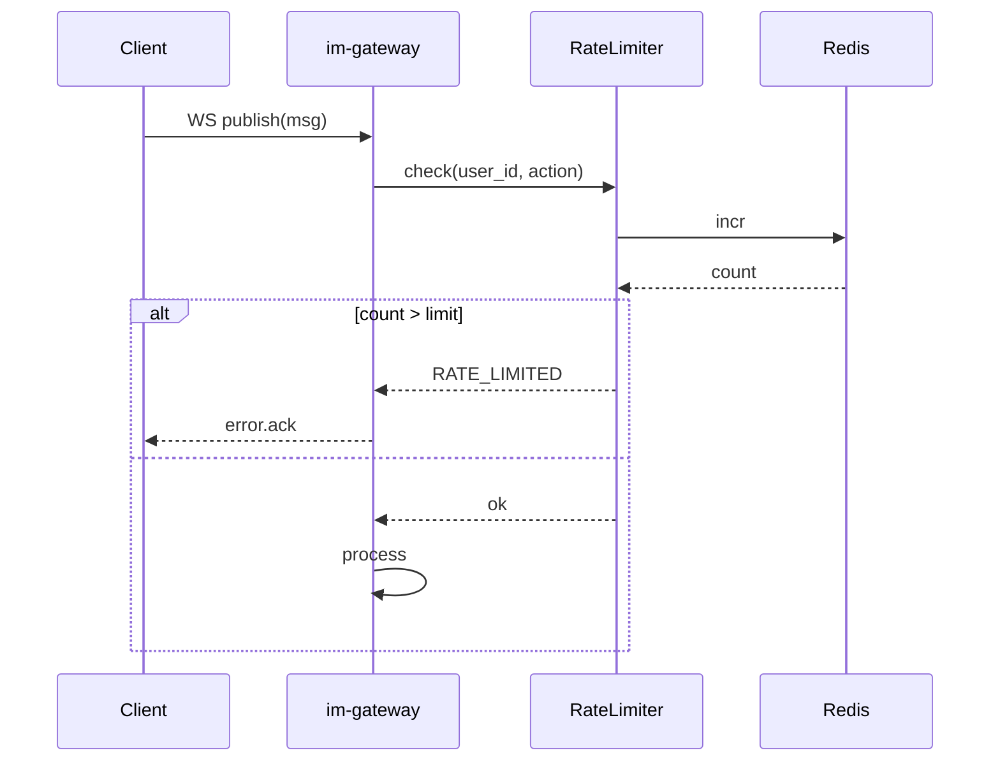
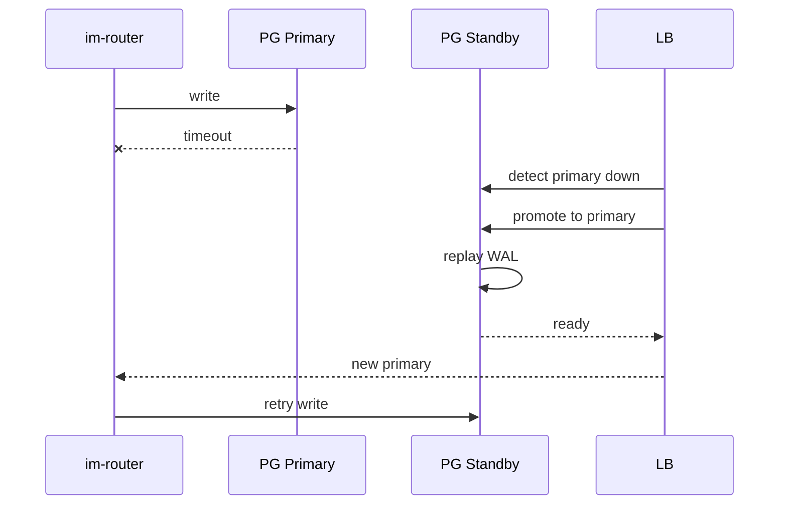
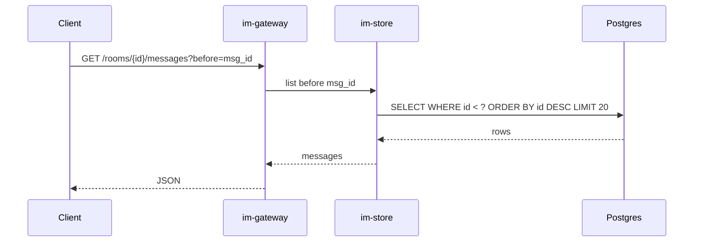
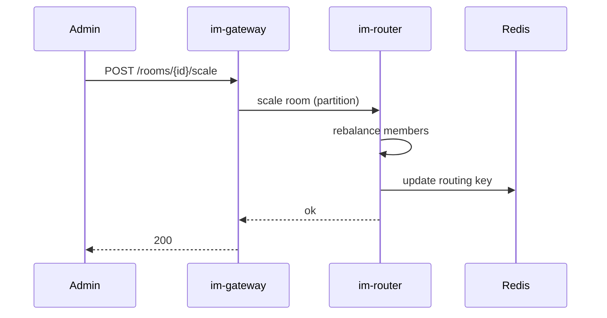

# aux-11. 重要業務シナリオ時系列図集 / 关键场景时序图集

> 项目: **IM1.0**
> 阶段: 詳細設計 / Detailed Design(辅助)
> 责任方: Architect

## 1. 目的 (Purpose)

用 mermaid 时序图固化关键业务场景,作为跨团队沟通和代码评审的参照。

## 2. 适用范围 (Scope)

核心业务 + 关键故障 / 异常路径。

## 3. 责任方 (Owners)

Architect

## 4. 前置依赖 (Prerequisites / Inputs)

- 架构图(24)
- 46 API 详细
- 47 DB 详细

## 5. 输出 / 模板正文 (Body)

## 1. 用户发送消息(正常)

## 2. 用户加入语音房间

## 3. 管理员封禁用户

## 4. 故障转移(im-gateway 主从切换)

## 5. 限流命中

## 6. 数据库主从切换

## 7. 历史消息分页

## 8. 房间扩容(成员超过阈值)

---

## 维护

- 新增场景:评审通过后追加
- 旧场景:代码变更后必须更新对应图
- 评审:每张图作为该场景编码的"必经"参照

## 6. 验收标准 (Acceptance Criteria)

每个核心业务场景有对应时序图;时序图与代码实现一致;新场景加入时需评审。

## 7. 关联文档 (References)

- 关联工程活动: 24 架构, 46 API 详细, 84 故障注入
- 上游 Workflow: `docs/Workflow.md` Phase 4

## 8. 变更记录 (Change Log)

| 版本 | 日期 | 修订人 | 内容 |
|---|---|---|---|
| 1.0.0 | YYYY-MM-DD | (待定) | 初版 |
